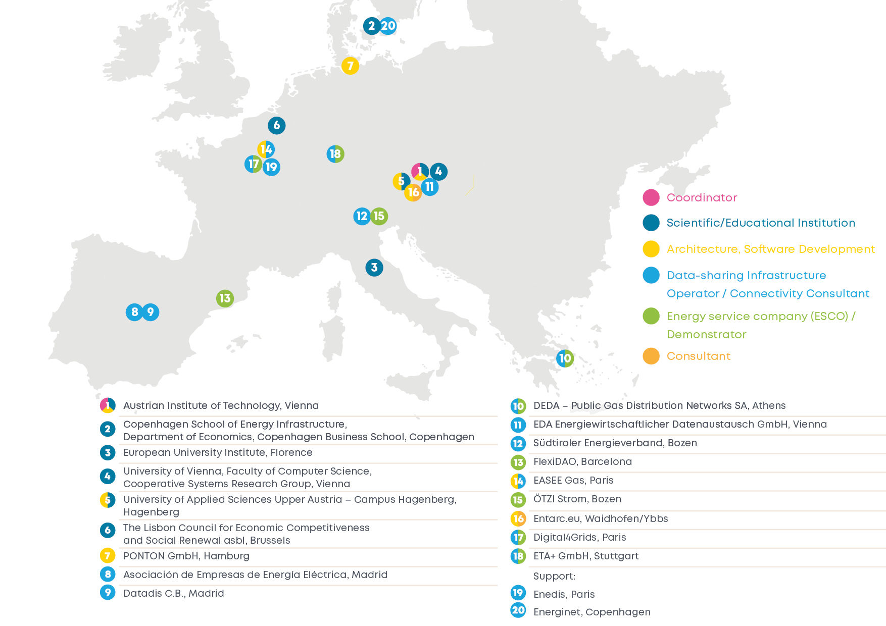

<!-- Describes the relevant requirements and the driving forces that software architects and the development team must consider. These include

-   underlying business goals,
-   essential features,
-   essential functional requirements,
-   quality goals for the architecture and
-   relevant stakeholders and their expectations -->

Today, more and more energy data-based services emerge within and beyond the energy sector, enabled by European legislation. In the energy sector, Directive (EU) 2019/944 of the Clean Energy for all Europeans Package [1] recently established the rights to access energy-related metering, production and consumption data for customers and eligible parties of their choice. Services of this kind empower customers, can consult energy buyers based on their consumption patterns or contribute to efficient energy management, amongst others.

However, the main barrier today is that there is no large scale, uniform and easy access to energy data across European Member States (MSs), which is a severe handicap for new services, e.g., as web-based or mobile applications, to emerge, raise the energy awareness of citizens and foster economic growth on a European level. Currently, players also act on national data-sharing infrastructure and practices, which limits their interoperability and growth perspective. These constraints of national data-sharing infrastructure have an industrial, economic and social dimension on a European level and beyond.

On an industrial, but also economic level, it is hard to find out, how to get access to different kinds of energy-related data in other MSs (e.g., consumption patterns, production). Even if the know-how is available, it is still a considerable effort to develop and maintain connectivity with another MSs data-sharing infrastructure. Reports show that 50% to 80% of the costs of data projects go into data integration [2]. These high costs for data integration imply that new smart and much-needed actors in our energy system cannot focus on their already complex core tasks – e.g., provide customers with energy efficiency services or (enabling customers to) provide services to the grid. On a social level, the awareness of European citizens about their energy consumption is – if the data is available at all – mostly limited to national surroundings which hinders the deployment of cross-border energy services especially in close to the border regions.

In earlier years of data science and data-driven solutions, metaphors were often used to highlight the growing importance of data. From a solution providers perspective, data is often said to be like butter – as it makes everything better. From a business perspective, data is sometimes seen as the new oil – you can mine it, refine it and then sell it.  For a successful Green Energy Transition, empowered by smart grids and smart solutions, we see data rather as the new water which must be fresh, clean and available to all in need.

With regards to the state-of-the-art, the topic is growingly prominent on conferences and in discussions between European actors on an administrative and scientific level. There has been a race for a European central data hub – a platform where metering and consumption data is bunkered and made available to services in need. Discussions in European Expert Groups showed that a “central data hub” probably is not the best of all ideas, because of its role as a Single Point of Access, Control or Failure and dependencies that would come with it – amongst other issues. It also hinders innovation and is problematic because of national distribution of responsibilities and data protection environment conditions. Moreover, it is important to commemorate that we do not know the criticality levels of future services based on that data currently available as these services are still to emerge. Another direction initiatives tried to move to, was the establishment of a European communication layer above the MS data exchange environments to provide a European interface – sometimes with ancillary services attached to deal with inevitable workarounds caused by the approach. Due to the problems with such centralised, dependent and inflexible solutions, the EDDIE consortium drafts a completely decentralised, distributed, open-source Data Space solution, aligned with directions of the work on the Implementing Acts on Interoperability as mandated by Article 24 of Directive (EU) 2019/944, the European Data Strategy and accommodated with the European Data Spaces Initiative.

Our envisioned project European Distributed Data Infrastructure for Energy (EDDIE) lowers data integration costs drastically to tackle the existing economic problem of the non-existent or limited energy data interoperability. Concerning the industrial limitations, the resulting EDDIE Framework will let energy service companies work and compete in a common European market. EDDIE’s vision is to make it cheap and easy for smart, data-based energy-related services to operate on a common European Energy Data Space and a streamlined, uniform European interface to data usable by everyone from energy service companies to end-user customers, which also targets the social problem of the limited access to energy data. The envisioned streamlined and uniform European interface to energy data also means that European customers will have a far greater choice between solutions due to the opportunity to share their metering and consumption data with services from other MSs directly without a central instance. These new technical and market-related opportunities will boost competition, quality and functionality of energy-data based services by drastically reducing cost-per-customer and leveraging economies of scale, because 50% to 80% of the costs for data integration [2] can be saved.

In addition to industrial, economic and social problems, EDDIE tackles another technical problem and closes a significant gap for the further development of data-based solutions in the energy domain: the lack of streamlined, secure and easy access to measurements of in-house sensors (e.g., Internet of Things (IoT) devices in households). The Administrative Interface for In-house Data Access (AIIDA) will provide the customer with the infrastructure to share these data streams close to real-time with remote services on a manageable, GDPR-compliant consent basis.

Together, the EDDIE Framework and AIIDA will enable interoperable, truly European solutions based on data available in online energy data hubs and “in-house data”. These two main components form the European Distributed Data Infrastructure for Energy – EDDIE – form the nucleus for a Common European Energy Data Space, which is the ultimate goal of this call EDDIE is proposed for and contributes to as described next.

## Business Goals

With the call for proposals to Establish the Grounds for a Common European Energy Data Space, the European Commission seeks for solutions that develop, validate and demonstrate an Energy Data Space that enables access to and use of energy data as well as the comparison with different solutions [3] to do the groundwork for a later, more advanced landscape. This groundwork and the first step are the access to organised and efficient availability of energy-related data, a plan for interoperability with co-existing data spaces and an appropriate strategy to strengthen the paradigm shift described above, as well as to create a future-proof and extensible basis to drive the topic further.

Following this guidance, we propose EDDIE – a European Distributed Data Infrastructure for Energy – with six main objectives as solution to Establish the Grounds for a Common European Energy Data Space as described in Table 1.

<table>
<tr>
    <th style="width: 8ch">Obj.  Nr</th>
    <th style="width: 60%">Description of Main Objective (OBJ)</th>
    <th>Related WP (Tasks) and Milestone (due month)</th>
</tr>
<tr>
    <th>OBJ#1</th>
    <td>Deliver a unified, de-central and highly scalable European interface – the EDDIE Framework – to validated historical and near real-time energy consumption data from different data sources based on the work of the EU Smart Grids Task Force’s Expert Group 1 for data interoperability.</td>
    <td><li>WP2 (T2.1, T2.2, T2.3, T2.4)
        <li>Milestone 3 (M18)</td>
</tr>
<tr>
    <th>OBJ#2</th>
    <td>Develop a consent-based interface – the Administrative Interface for In-house Data Access (AIIDA) – installable in standard home automation environments and in-house computing systems to facilitate the consent-based use of in-house data sources from smart meters and downstream submetering like the standardised interface mandatory for all smart metering systems installed after July 4th, 2019, as required by Article 20(a) of Directive (EU) 2019/944.</td>
    <td><li>WP3-4 (T3.1, T3.2, T3.3, T3.4, T4.1, T4.2, T4.3, T4.4)
        <li>Milestone 3 (M18)</td>
</tr>
<tr>
    <th>OBJ#3</th>
    <td>Provide demonstrated connectors to that unified European interface for more than 70% of European metering points with the deliverables produced as part of the EDDIE Framework, and clearly defined paths to attach more.</td>
    <td><li>WP5-6 (T5.2, T5.3, T5.4, T6.2, T6.3, T6.4, T6.5, T6.6, T6.7)
        <li>Milestone 4 (M24)</td>
</tr>
<tr>
    <th>OBJ#4</th>
    <td>Carry out scientific assessment of relevant aspects of energy data-sharing covering energy and behavioural economics, data privacy, governance, portability and compliance considerations, as well as a much-needed security and safety views on these infrastructures, keeping in mind that the criticality levels of services based on shared energy data might not be clear yet.</td>
    <td><li>WP6-8 (T6.1, T6.2, T7.1, T7.2, T7.3, T7.4, T8.5)
        <li>Milestone 4 (M24)</td>
</tr>
<tr>
    <th>OBJ#5</th>
    <td>Ensure that EDDIE is ready to be used, to stay, and to be further developed by an open-source community, European organisations and players with a stake or interest in general by means of diverse exploitation and dissemination activities. All software components delivered by EDDIE will be ready-to-use and feature technology readiness level (TRL) 7 or better.</td>
    <td><li>WP2 (T2.4), WP7-9 (T7.2, T8.1, T8.2, T8.4, T8.5, T9.1, T9.2, T9.3)
        <li>Milestone 5 (M30)</td>
</tr>
<tr>
    <th>OBJ#6</th>
    <td>Identify and disseminate small or big hurdles while conceptualizing and developing EDDIE to Member State (MS) data-sharing infrastructure operators, national and European legislation to allow for improvement and convergence in that sector.</td>
    <td><li>WP1-9 (T1.3, T2.3, T3.1, T4.1, T5.1, T6.1, T7.1, T7.3, T7.4, T8.3, T9.2)
        <li>Milestone 7 (M36)</td>
</tr>
</table>

Table 1 The six main objectives of EDDIE including a reference to related Work Packages, Tasks and Milestones

1.1.3	Vision and uniqueness of EDDIE
The vision of EDDIE and what makes EDDIE specific, is that it aims for a solution that is (1) decentralised, (2) open-source, (3) not-for-profit and (4) far-reaching. In the following, we describe these four pillars that form EDDIE’s vision for a unique solution in detail:
•	Decentralised: The EDDIE Framework is installable on any computer or cloud environment under the full control of the actor using it. There is no need for a central instance or a Pan-European Data Hub. The decentralised approach also guarantees for a maximum degree of scalability, flexibility and resilience.
•	Open-source: The EDDIE Framework and AIIDA can be freely downloaded, forked and changed, without any fees or licensing constraints. After the project lifecycle, the EDDIE consortium will transfer the management and maintenance to a relevant body. That point in time will also coincide nicely with European developments in the field of interoperability and the decision to which organisation to hand over will be respecting these.
•	Not-for-profit: Apart from the innovation and know-how generated in the work on EDDIE, neither of the consortium partners is expecting any direct returns or profit out of the deliverables. All participants have expertise in different domains or geographical areas, which they want to contribute to a greater – common – profit and a reliable infrastructure for an enhanced market.
•	Far-reaching: EDDIE is for a good share initiated and driven by European data-sharing infrastructure operators who are participants in the consortium. This involvement means that we have these organisations aboard which need to make the data available directly in the project and on a broad geographical basis. There will be three phases for connectivity with regional data hubs. The Phase 1 will be with contributors to the consortium (already adding up to more than 69% of European metering points as estimated in section 1.2.7), the Phase 2 will be with other data hubs not directly in the project (25%) and a Phase 3 adds data-sharing infrastructures outside Europe. So, EDDIE aims on making available more than 70% of European metering points (taking into account that not all attempted regional connectors will be feasible due to environmental factors) – see Figure 1.

In addition to these aforementioned four pillars that form EDDIE’s vision for a unique solution, the whole consortium plays also a unique role for EDDIE as later described in details in Section 3.2, but introduced for contextual reasons here to support the project’s vision. The idea for EDDIE was born in the work in European initiatives. A lot of individuals contributing to the project are part of European expert groups. The combined knowledge, resources, cooperation and network of all members within the consortium will ensure that the direction of EDDIE will be aligned with the latest developments in their fields and also use EDDIE to try new legislative or regulatory effects, before they get coined into law. In the following, we provide a brief overview only to give an impression of the consortium.

The consortium of EDDIE includes leading experts on data-sharing, data interoperability, smart grids, electricity and gas metering, standardisation, distributed flexibility and legislation in Europe, modelling and IT development, dissemination and a broad coverage of data-sharing infrastructure operators, who will contribute with connecting and opening their national environments. Together, they feature more than 60% of European metering points for electricity alone.

Well established and experienced software development organisations – academic and industrial – will apply modern, agile methods and deliver the architecture and implementation efforts to ensure dependable and usable software deliverables. Each of the participants in that area are leaders in their field – from interoperable and mission-critical business-to-business (B2B) integration to energy exchange software, security-related to mobile system development.

A true and specific asset of EDDIE are the high-profile individuals contributing. Many have outstanding records of their activities in European associations, legislative activities and enterprises and will ensure the alignment of EDDIE with the European framework and objectives of initiatives like the upcoming Implementing Acts for Interoperability Requirements and Transparent Procedures for Access to Data following Article 24(2) of Directive (EU) 2019/944, activities around new Network Codes on rules regarding demand side flexibility, including rules on aggregation, energy storage and demand curtailment rules and sector-specific rules for cyber security of cross-border electricity flows [4], the digital taskforce of SmartEn [5], DG ENER’s Action Plan for the Digitalisation of the Energy Sector as announced in the European Commission’s Energy System Integration Strategy under the EU Green Deal [6] and DG CONNECT’s European Data Spaces Initiative as announced in the European Strategy for Data under the EU Green Deal [7] and further refined in the Proposal for a European Data Governance Act [8]. Moreover, EDDIE consortium partners are actively involved in the relevant ongoing workstreams of the EU Smart Grids Task Force Expert Group 1 for Data Interoperability and Distributed Flexibility (EG1). Figure 2 illustrates the geographical distribution and names of all EDDIE consortium members across Europe.

## Essential Features

1.1.4	Key Exploitable Results (KERs), outcomes and impact
Our proposed European Distributed Data Infrastructure for Energy (EDDIE) will provide a unified European interface for more than 70% (with a path up to 94%) of European metering points that enables access to and use of energy data for many players from energy service providers, companies, institutions to end-user customers. In combination with the vision of EDDIE to be decentralised, open-source, not-for-profit, far-reaching and developed by highly qualified consortium, this leads to four Key Exploitable Results (KERs) as described in Table 2.
KER Nr.	Description of Key Exploitable Result (KER)	Related to Objective
KER#1	Provide the EDDIE Framework as a dependable, scalable and extensible European Distributed Data Infrastructure for Energy Framework (EDDIE Framework), open-source and free to use and change. The EDDIE Framework will be installable in the domain of eligible parties with the need of access to energy data on a customer consent basis. There will be no need for additional centralised intermediaries. This main outcome is aligned with European interoperability, digitalisation and data-related legislation, and also provides means to feed back into these initiatives, leading in turn to better informed decision-making.	OBJ#1
KER#2	Provide AIIDA as an Administrative Interface for In-house Data Access (AIIDA), easily integrable in domestic software systems like smart home solutions or edge devices, making use of existing or additional hardware to be easily deployed in consumer houses. Provide customers a new solution to make available data streams from the standardised near real-time interface on the smart meter (priority) and a variety of in-house sensors. Allow customers to share their data with services using the EDDIE Framework, on a secure, clean and manageable consent basis. 	OBJ#2
KER#3	Provide extensive scientific assessment and share real-world experience on various aspects of data-sharing, from a social, economic and technological point of view. The academic institutions within the EDDIE consortium will care about this scientific assessment from energy and behavioural economics, regulatory and legislative, and system safety and security aspects. For all prototypes, we put a focus on human-centred design and user research to support the social acceptance of new energy technologies and increase participation of consumers in energy. 	OBJ#4
OBJ#6
KER#4	Provide the EDDIE Data Services Market Place as a web-based and/or mobile solution, which allows end-users to easily access applications based on the EDDIE Framework, learn about the services offered, use services of interest and participate in the data-sharing community. End-users must and will always retain full control over their own and private data at all times. The EDDIE Data Services Market Place will also contain all demonstrated prototypes.	OBJ#3
OBJ#5
Table 2 Overview of project participants, together with their geographical position and roles

As the reliable ground for an energy data space, EDDIE will be developed in close cooperation with actual users, key actors from European expert groups, leading European associations, data-sharing infrastructure providers, scientific experts, and other stakeholders, from within the consortium and beyond. Moreover, the use of the EDDIE Framework will be demonstrated by (1) productive services that are currently acting on national scale and will be in the position to act in multiple MSs with the help of the framework, (2) cross-sectoral applications to be developed within the scope of the project, (3) a use case that features a realistic scenario for the potential of Electricity and Gas metered data in the context of Sector Coupling and (4) a prototype of the potential of access to in-house near real-time data streams for the utilisation of prosumer flexibility.

The wider scientific, economic and societal impact of EDDIE and how the results directly contribute to the expected outcomes of the work programme are described later in detail in section 2.1.1. At this point, we give a brief introduction and overview.

Throughout the implementation of EDDIE, we will closely monitor ongoing developments in the field of data-sharing infrastructure and technologies and will – during the project – accommodate these developments, where relevant. At the time of writing, important related initiatives like GAIA-X [9] and EIDAS [10] electronic IDs (eID) are emerging. Although not in a state directly usable for EDDIE, GAIA-X will complement the decentralised approach of the distributed data infrastructure. If GAIA-X becomes usable during project runtime, steps will be taken to exploit the new opportunities. In route of the comitology process for the upcoming Implementing Acts for Interoperability and Data Access following Art. 24(2) of Directive (EU) 2019/944 it has been identified, that especially eID has the potential to drastically lower the hurdles for eligible parties/services from another Member State than the customer. At the moment, in some countries eligible parties need to undergo complicated and long-running validation processes, which would become a matter of seconds with supported EU Logins at least for onboarding processes. A close cooperation and interoperability with other initiatives (e.g., European Data Spaces, International Data Spaces Association, Data Spaces Business Alliance) will be sought throughout the project’s implementation.

All outcomes and activities of EDDIE will contribute to the Establishment of the Ground for a Common European Energy Data Space, paving the way for future – even more visionary – developments, based on the infrastructure provided by EDDIE. In the long term this contributes to CO2 reduction by allowing smarter services for end-user customers to act much more efficiently and reliably, and help to promote and maximise the usage of renewable energy and flexibility services across the Pan-European Energy system. Through two demonstrators dealing with Sector Coupling, EDDIE can also provide a role model for the importance of structured data-sharing to allow for a clean hydrogen transition as well as take full of advantage of Vehicle-to-Grid (V2G) flexibility.

Moreover, with EDDIE we present a strategy to ensure the wide usability, adjustability and application of EDDIE within and beyond the project duration: (1) The consortium is fully committed to the open-source idea: all project deliverables will be free to download, fork and use; (2) Training activities will be carried out, including a strategy how to continue after the project; (3) Academic partners will train students on EDDIE and let them implement prototype applications in their teaching activities.

1.2	Methodology

1.2.1	Overall methodology

The overall methodology of EDDIE is oriented towards the first main objective to (OBJ#1) provide a dependable, scalable and extensible European Distributed Data Infrastructure for Energy Framework (EDDIE Framework). This means that the overlying European interface will be given priority, and data accessible through data-sharing infrastructure (1) provided by metered data administrators will be available first. In parallel, and independently but synchronised, the work on the second main objective to (OBJ#2) provide an Administrative Interface for In-house Data Access (AIIDA) to feed in-house data (2) to EDDIE Framework users will be started.

Both together, the EDDIE Framework and AIIDA will be put into a consistent overall architectural environment in an extensive architecture and specification phase planned for the first six months of the project. Publicly available data (3) from different Member States (MSs) also often has some hurdles to take and should also be part of a unified interface in the future, but for the initial EDDIE project, it shall be out of scope. See Figure 3 that illustrates the 3 major data family groups (1–3) considered within EDDIE as described in detail in the following:

•	Data-sharing infrastructure: These are national energy data management environments and online data hubs. Historical metering and consumption data is collected, validated and stored at entities that need to make that data available in turn to established actors or eligible parties. At the moment, this is done diversly and by different players in each Member State. Also, different processes need to be followed and data is delivered in different formats and schemas. The EDDIE Framework communicates with these data-sharing infrastructures and provides a streamlined consent management user flow and a transformation towards a common pivotal format.
•	In-house data sources: Currently, near real-time data can in most MSs be read from the “standardised interface” on the smart meter (if it has been ordered and installed after July 4th 2019). If the customer manages to connect to that interface and make that data processable, it is still only available in-house and it needs to be transformed to a common format. The Administrative Interface for In-house Data Access (AIIDA) will be in the position to read that data from different meter models, standards and configurations and make it available through an online consent-based mechanism. This means that users of services that are based on the EDDIE Framework can be shown a button on e.g., the service website saying “connect my in-house data” and will be routed to their Consent Management Interface (within AIIDA). If a consent is given, the AIIDA instance will deliver the requested data to the EDDIE Framework of the service for which a consent was granted. Not only main meter interfaces will be supported, but also others (e.g., sub-meters).
•	Publicly available data: There is also other – often publicly available – data, that is necessary for many processes, but does not directly belong to the customer and also does not show consumption or generation time series characteristics. National weather forecasts, price feeds or market reference data fall under this category. These data families are still depicted diversely and by different players depending on the country. Optionally, but if the time allows, the EDDIE project team will also address this field and strive to make it available in a unified pivotal format through the EDDIE Framework.

Activities towards the fourth main objective to (OBJ#4) provide extensive scientific assessment and share real-world experience on various aspects of data-sharing will start accompanying these developments and when the architecture and specification phase is completed and Milestone 2 (project month 9) is achieved. Implementation of software and systems to be developed within EDDIE will deliver usable and assessable preliminary results soon, to ensure that their contribution is aligned with the overall objectives during the whole lifecycle of the project. Following this rationale, software deliverables will be released on the open-source code management platform (GitHub [11]), so that all interested stakeholders can easily test and provide feedback. It is planned to ramp up dissemination and future development and maintenance through options like the formation of a new or the adoption of the project results by an existing open-source foundation such as the Linux Foundation for Energy [12] or European organisations.

Project EDDIE covers a multiplicity of diverse aspects and will tackle a lot of highly demanding challenges that require interdisciplinary cooperation between scientists, legislative and regulatory experts, enterprise architects, software developers and infrastructure operators with outstanding expertise in different domains. Throughout the whole lifecycle of the project, representatives from different contributing partners covering the whole vertical spectrum of the respective task will co-operate closely without borders between organisations and within agile project structures to solve the described challenges together. It is crucial to avoid the development of knowledge and organisational silos. The team is aware of Convey’s law [13], which states that organisations design systems that mirror their own communication structure. Therefore, and to make use of emergent expertise and cross-domain problem solving, a whole-team approach is utilised. Table 3 describes related national and international research and development activities of project participants whose results will feed into EDDIE.

## Essential Functional Requirements

The essential functional requirements are listed below. A more elaborate description of the requirements can be found in [Section 10](/10-quality-requirements/).
- Decentralized: The consumer data must be shared only with eligible parties (i.e., that have the permission of the consumer). A central place that aggregates consumer data without the permission of the consumer must not be used.
- Scalable. The consumer must be able to share their data with multiple eligible parties. Moreover, an eligible party must be able to collect data from multiple consumers.
- Extensible. The framework must be extensible so that adding unsupported energy providers does not involve significant engineering/developing effort.

## Quality Goals

<!-- The top three (max five) quality goals for the architecture whose
fulfillment is of the highest importance to the major stakeholders. We
mean quality goals for the architecture. Don't confuse them with
project goals. They are not necessarily identical.

A table with quality goals and concrete scenarios, ordered by priorities -->

The main goals of the architecture are:
<!-- (based on the ISO 25010 standard) -->
- Usability: The framework can be understood, learned, and used, and is attractive to users.
- Maintainability: the framework can be modified, corrected, adapted, and extended to react to changes in the environment.

## Stakeholders

<!-- Explicit overview of stakeholders of the system, i.e. all persons, roles
or organizations that

-   should know the architecture

-   have to be convinced of the architecture

-   have to work with the architecture or with code

-   need the documentation of the architecture for their work

-   have to come up with decisions about the system or its development -->

Persons that may make use of this document can have the following roles:

| Role | Expectation |
|-|-|
| Product owner | Needs to understand the overall structure of a system that uses the framework, e.g., to be able to prioritize development tasks. |
| Software architect | Needs to understand the architecture of a system that uses the framework,e.g., to be able to design services. |
| Software Developer | Needs to understand the functionality of a specific component, e.g., to be able to perform code modifications. |
| DevOps Engineer | Needs to understant the interactions among the components of the framework, e.g., to be able to deploy and run the framework. |