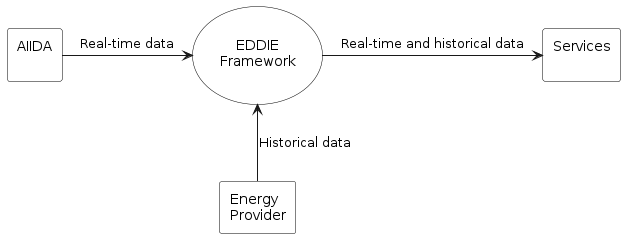
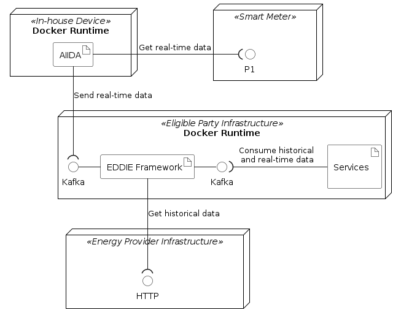

<!-- System scope and context - as the name suggests - delimits your system
(i.e. your scope) from all its communication partners (neighboring
systems and users, i.e. the context of your system). It thereby
specifies the external interfaces. If necessary, differentiate the 
business context (domain specific inputs and outputs) from the 
technical context (channels, protocols, hardware).

Various options:
-   Context diagrams
-   Lists of communication partners and their interfaces. -->

# System Scope and Context

The context of the system is described by showing the external interfaces and by specifying inputs and outputs. We differentiate between business context and technical context (for the same system).

## Business Context

<!-- All kinds of context diagrams that show the system as a black box and specify
the domain interfaces to communication partners. Alternatively 
(or additionally) you can use a table, the three columns contain the name of
the communication partner, the inputs, and the outputs. -->

From a business perspective, the system consists of four entities which are shown in the context diagram below.

<!--  -->

This context diagram shows how the EDDIE framework (in the center of the figure) interacts with its environment. Three other entities are part of the system:

1. AIIDA (Administrative Interface for In-house Data Access)
1. Energy provider 
1. Services

The table below shows a description of all the entities of the context diagram.

| Component | Description | Within Scope |
|-|-|-|
| AIIDA | Aggregates real-time data from an energy metering device (e.g., a smart meter or an IoT home automation system), and sends this data to the EDDIE framework. | &#x2611; Yes | 
| Energy provider | Provides historical data about the energy consumption of an energy consumer (e.g., energy consumption within a house). | &#x2612; No|
| EDDIE framework | Aggregates energy data from AIIDA and the energy provider (can be multiple instances of AIIDA and energy providers), and consolidates it. | &#x2611; Yes |
| Services | Acquire consolidated data from the EDDIE framework and use it to generate value, e.g., using data analysis services that are based on statistics, machine learning, and artificial intelligence approaches. | &#x2612; No |

The figure above shows how the services of an eligible party can acquire real-time data (from AIIDA) and historical data (from the energy provider) using the EDDIE framework. The eligible party is then expected to process this data using services (as discussed in quality goal No. 2 mentioned in Section [Introduction and Goals](/1-introduction-and-goals/README.md)). Interestingly, an energy provider can also act as an eligible party that aggregates energy data and processes it using the existing services. This way, a consumer can use services that are offered by any energy provider in the same or different country (as discussed in quality goal No. 2 mentioned in Section [Introduction and Goals](/1-introduction-and-goals/README.md)).

Notably, **one eligible party must be able to use one instance of an EDDIE framework to communicate with one or more instances of AIIDA and energy providers**. This way, the eligible party can aggregate data from multiple consumers thereby being able to implement services that leverage large datasets of energy information (i.e., not only from one consumer).

## Technical Context 

<!-- Technical interfaces (channels and transmission media) linking your system to its environment. In addition a mapping of domain-specific input/output to the channels, i.e. an explanation of which I/O uses which channel.

E.g. UML deployment diagram describing channels to neighboring systems, together with a mapping table showing the relationships between channels and input/output. -->

From a technical perspective, the system includes four types of nodes which are:
1. Smart Meter: A device installed in a house by the energy provider, which measures data about the energy consumption of the house, and exposes this data via a P1 port.
1. In-house Device: A device such as a raspberry Pi that connects to the smart meter via a P1 port, and implements the Docker Runtime for executing applications.
1. Eligible Party Infrastructure: Either on-premise or cloud-based computing infrastructure that implements the Docker Runtime for executing applications.
1. Energy Provider Infrastructure: The infrastructure of the energy provider that is assumed to provide HTTP interfaces for various processes, e.g., for exposing historical energy consumption data.

The figure below shows the associations between artifacts and interfaces as well as the communication protocols of these interfaces.

<!--  -->

The following table shows a description of the artifacts.

| Artifact | Description |
|-|-|
| AIIDA | Implements the functionality to acquire real-time data from the smart meter via P1, and send this data to the EDDIE Framework via a Kafka interface. |
| EDDIE Framework| Implements functionality to receive real-time data from one or more AIIDA instances via a Kafka interface. Also, to acquire historical data from one or more energy providers via HTTP. |
| Services | Implement functionality to acquire large datasets of real-time and historical data via a Kafka interface, and to process this data using data minining and machine learning algorithms. The implementation of the services is out of scope of this document.

The table below shows a summary of the interfaces.

| Interface | Provided by | Consumed by | Protocol |
|-|-|-|-|
| Smart Meter Interface | Smart meter| AIIDA | P1 |
| EDDIE Framework Interface | EDDIE Framework | AIIDA | Kafka |
| EDDIE Framework Interface | EDDIE Framework | Services | Kafka |
| Energy Provider Interfaces | Energy Provider | EDDIE Framework | HTTP |

A description of how the artifacts operate in order to achieve their goal (e.g., what is the procedure for the EDDIE Framework to acquire historical data) is presented in Section [Solution Strategy](/4-solution-strategy/README.md).

