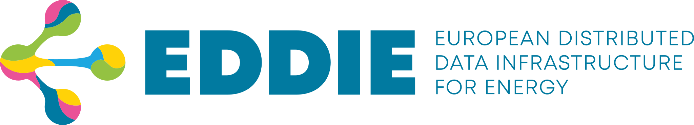

# EDDIE Architecture

This repository documents the software architecture of EDDIE (European Distributed Data Infrastructure for Energy) based on [arc42](https://arc42.org/).
EDDIE is a research project co-funded by the European Union's Horizon Innovation Actions under grant agreement No. 101069510.

- To view the architecture documentation, click [here](https://architecture.eddie.energy/architecture/).
- To view the guidelines for contributing, click [here](./CONTRIBUTING.md).

To edit the website locally:

1. Install [NodeJS](https://nodejs.org)
2. Run `npm install`
3. Run `npm run dev`
4. Open https://localhost:5173 in a browser

## Diagrams

The [Structurizr DSL](https://docs.structurizr.com/dsl) is used to define C4 diagrams.
These diagrams are defined in the [diagrams/workspace.dsl](./diagrams/workspace.dsl) file and [published](https://diagrams-eddie.projekte.fh-hagenberg.at/share/1) using the [Structurizr CLI](https://docs.structurizr.com/cli).

To run the Structurizr UI for local editing:

1. Install [Docker](https://www.docker.com/)
2. Run `docker compose up`
3. Open https://localhost:8080 in a browser

## Interesting links:

- [EDDIE Website](https://eddie.energy/)
- [EDDIE Linkedin](https://www.linkedin.com/company/eddie-energy/)
- [EDDIE GitHub](https://github.com/eddie-energy)
- [EDDIE Zenodo](https://zenodo.org/communities/eddie/)
- [EDDIE CORDIS](https://cordis.europa.eu/project/id/101069510)
