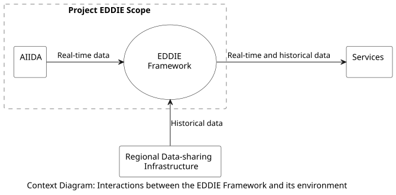
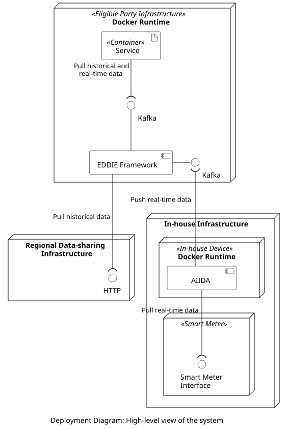

<!-- System scope and context - as the name suggests - delimits your system
(i.e. your scope) from all its communication partners (neighboring
systems and users, i.e. the context of your system). It thereby
specifies the external interfaces. If necessary, differentiate the 
business context (domain specific inputs and outputs) from the 
technical context (channels, protocols, hardware).

Various options:
-   Context diagrams
-   Lists of communication partners and their interfaces. -->

The context of the system is described by showing the external interfaces and by specifying inputs and outputs. In the following, we differentiate between business context and technical context (for the same system).

## Business Context

<!-- All kinds of context diagrams that show the system as a black box and specify
the domain interfaces to communication partners. Alternatively 
(or additionally) you can use a table, the three columns contain the name of
the communication partner, the inputs, and the outputs. -->

From a business perspective, the system consists of four entities which are shown in the context diagram below.

<!--  -->

This context diagram shows how the EDDIE Framework (in the center of the figure) interacts with its environment. Three other entities are part of the system:

1. AIIDA (Administrative Interface for In-house Data Access)
1. Regional Data-sharing Infrastructure
1. Services

The table below shows a description of all the entities of the context diagram.

| Component | Description | Within Scope |
|-|-|-|
| AIIDA | This is a software component that is deployed on an in-house device and connects to the house's energy metering devices. AIIDA collects real-time data from metering devices (e.g., a smart meter and/or an IoT home automation system), and sends this data to the EDDIE Framework. | &#x2611; Yes | 
| Regional Data-sharing Infrastructure | This is the existing infrastructure of a Member State that provides access to historical data (e.g., validated historical metering data) about the energy consumption of a customer (e.g., energy consumption within a house). This infrastructure is provided, e.g., by a metered data administrator. | &#x2612; No|
| EDDIE Framework | This is a software component that runs on eligible party owned/operated infrastructure (e.g., local or cloud computing resources). It aggregates real-time energy consumption data from AIIDA and historical validated consumption data from the Regional Data-sharing Infrastructure (can be multiple instances of AIIDA and Regional Data-sharing Infrastructures), and consolidates it. | &#x2611; Yes |
| Services | Each Service is a software component that is deployed by the eligible party on local/cloud computing resources. A Service acquires consolidated (real-time and/or historical) energy data from the EDDIE Framework and uses it to generate value, e.g., using data analysis methods that are based on statistics, machine learning, and artificial intelligence. Entities that can have a particular interest in taking the role of the eligible party and running Services for processing energy data can be, e.g.,  energy service providers and flexibility service providers. | &#x2612; No |

The figure above shows how the Services of an eligible party can acquire real-time data (from AIIDA) and historical data (from a Regional Data-sharing Infrastructure) using the EDDIE Framework. The eligible party is then expected to process this data using the Services, and potentially provide the output of these Service back to the customer. An example of this process can be an eligible party that offers a Service that provides energy consumption recommendations to customers. This Service processes real-time and historical consumption data of a customer and calculates recommendations that can help the customer, e.g., to reduce the electricity bill by achieving off-peak pricing.

Notably, **one eligible party deploys one instance of the EDDIE Framework to communicate with one or more instances of AIIDA and Regional Data-sharing Infrastructures**. This way, the eligible party can collect data from one or more customers residing in one or more Member States.

## Technical Context 

<!-- Technical interfaces (channels and transmission media) linking your system to its environment. In addition a mapping of domain-specific input/output to the channels, i.e. an explanation of which I/O uses which channel.

E.g. UML deployment diagram describing channels to neighboring systems, together with a mapping table showing the relationships between channels and input/output. -->

From a technical perspective, the system includes four types of nodes which are:
1. Smart Meter: A device installed in a house, e.g., by a utility company, which measures data about the energy consumption of the house, and exposes this data, e.g., via a P1 port.
1. In-house Device: A device such as a Raspberry Pi computer that connects to the smart meter, and implements the Docker Runtime for executing applications.
1. Eligible Party Infrastructure: Either on-premise or cloud-based computing infrastructure that implements the Docker Runtime for executing applications.
1. Regional Data-sharing Infrastructure: This is the existing infrastructure of Member States that provides interfaces for: i) Requesting the consent of customers for access to their historical validated energy consumption data. ii) Accessing the historical validated energy consumption data of a customer (when the consent has been given). This infrastructure is provided by a utility company or a metered data administrator. 

The figure below shows the associations between software artifacts and interfaces as well as the communication protocols of these interfaces.

<!--  -->

The following table shows a description of the software artifacts.

| Artifact | Description |
|-|-|
| AIIDA | Implements the functionality to acquire real-time data from the smart meter, and send this data to the Framework, e.g., via a Kafka interface. |
| EDDIE Framework| Implements functionality to receive real-time data from one or more AIIDA instances, e.g., via a Kafka interface. Also, to acquire historical data from one or more Regional Data-sharing Infrastructures, e.g., via HTTP. |
| Service | Implement functionality to acquire real-time and historical data from the EDDIE Framework, e.g., via a Kafka interface, and to process this data using data mining and machine learning algorithms. The implementation of services is out of scope of this document.

The table below shows a summary of the interfaces.

| Provided by | Consumed by | Protocol |
|-|-|-|
| Smart meter| AIIDA | P1 (or other) |
| EDDIE Framework | AIIDA | Kafka |
| EDDIE Framework | Services | Kafka |
| Regional Data-sharing Infrastructure | EDDIE Framework | HTTP (or other) |

## Prerequisites

Since the EDDIE framework interacts with various external components and infrastructures (e.g., the Regional Data-sharing Infrastructures, and AIIDA instances), certain prerequisites and dependencies arise. All the prerequisites are outlined in link below. 

> [Prerequisites](./prerequisites/prerequisites.md)

