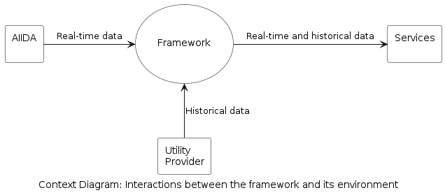
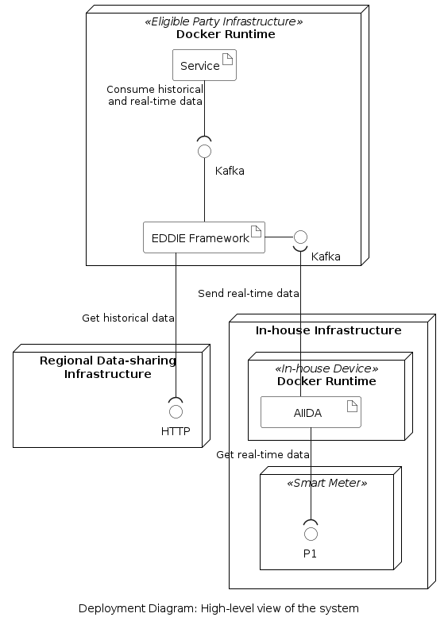

<!-- System scope and context - as the name suggests - delimits your system
(i.e. your scope) from all its communication partners (neighboring
systems and users, i.e. the context of your system). It thereby
specifies the external interfaces. If necessary, differentiate the 
business context (domain specific inputs and outputs) from the 
technical context (channels, protocols, hardware).

Various options:
-   Context diagrams
-   Lists of communication partners and their interfaces. -->

The context of the system is described by showing the external interfaces and by specifying inputs and outputs. We differentiate between business context and technical context (for the same system).

## Business Context

<!-- All kinds of context diagrams that show the system as a black box and specify
the domain interfaces to communication partners. Alternatively 
(or additionally) you can use a table, the three columns contain the name of
the communication partner, the inputs, and the outputs. -->

From a business perspective, the system consists of four entities which are shown in the context diagram below.

<!--  -->

This context diagram shows how the EDDIE Framework (in the center of the figure) interacts with its environment. Three other entities are part of the system:

1. AIIDA (Administrative Interface for In-house Data Access)
1. Regional Data-sharing Infrastructure
1. Services

The table below shows a description of all the entities of the context diagram.

| Component | Description | Within Scope |
|-|-|-|
| AIIDA | Collects real-time data from an energy metering device (e.g., a smart meter or an IoT home automation system), and sends this data to the EDDIE Framework. | &#x2611; Yes | 
| Regional Data-sharing Infrastructure | Provides historical data (e.g., validated historical metering data) about the energy consumption of an energy consumer (e.g., energy consumption within a house). This infrastructure is provided, e.g., by a Metered Data Administrator. | &#x2612; No|
| EDDIE Framework | Collects energy data from AIIDA and the Regional Data-sharing Infrastructure (can be multiple instances of AIIDA and Regional Data-sharing Infrastructure), and consolidates it. | &#x2611; Yes |
| Services | Acquire consolidated data from the EDDIE Framework and use it to generate value, e.g., using data analysis services that are based on statistics, machine learning, and artificial intelligence techniques. | &#x2612; No |

The figure above shows how the services of an eligible party can acquire real-time data (from AIIDA) and historical data (from a Regional Data-sharing Infrastructure) using the EDDIE Framework. The eligible party is then expected to process this data using services. This way, a consumer can use services that are offered by any organization that takes the role of the eligible party.

Notably, **one eligible party deploys one instance of the EDDIE Framework to communicate with one or more instances of AIIDA and Regional Data-sharing Infrastructures**. This way, the eligible party collects data from multiple consumers thereby being able to implement services that leverage large datasets with energy information (i.e., not only from one consumer).

## Technical Context 

<!-- Technical interfaces (channels and transmission media) linking your system to its environment. In addition a mapping of domain-specific input/output to the channels, i.e. an explanation of which I/O uses which channel.

E.g. UML deployment diagram describing channels to neighboring systems, together with a mapping table showing the relationships between channels and input/output. -->

From a technical perspective, the system includes four types of nodes which are:
1. Smart Meter: A device installed in a house by the utility provider, which measures data about the energy consumption of the house, and exposes this data via a P1 port.
1. In-house Device: A device such as a Raspberry Pi computer that connects to the smart meter via a P1 port, and implements the Docker Runtime for executing applications.
1. Eligible Party Infrastructure: Either on-premise or cloud-based computing infrastructure that implements the Docker Runtime for executing applications.
1. Regional Data-sharing Infrastructure: This infrastructure provides an interface for various processes including exposing historical energy consumption data. Interestingly, this infrastructure may be provided by a utility provider or a regional Metered Data Administrator. 

The figure below shows the associations between artifacts and interfaces as well as the communication protocols of these interfaces.

<!--  -->

The following table shows a description of the artifacts.

| Artifact | Description |
|-|-|
| AIIDA | Implements the functionality to acquire real-time data from the smart meter via P1, and send this data to the Framework via a Kafka interface. |
| EDDIE Framework| Implements functionality to receive real-time data from one or more AIIDA instances via a Kafka interface. Also, to acquire historical data from one or more Regional Data-sharing Infrastructures via the provided API, e.g., via HTTP. |
| Service | Implement functionality to acquire real-time and historical data via a Kafka interface, and to process this data using data minining and machine learning algorithms. The implementation of services is out of scope of this document.

The table below shows a summary of the interfaces.

| Provided by | Consumed by | Protocol |
|-|-|-|
| Smart meter| AIIDA | P1 |
| EDDIE Framework | AIIDA | Kafka |
| EDDIE Framework | Services | Kafka |
| Regional Data-sharing Infrastructure | EDDIE Framework | HTTP (or other) |

Notably, concrete details about the system scope from a product development perspective are presented [here](./01-mvp1/01-mvp1.md)
