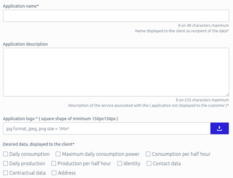
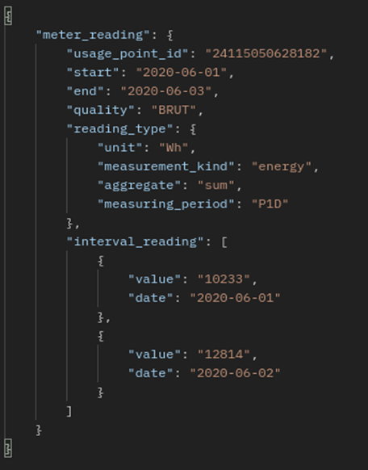

## Eligible Party Registration to the Regional Data-sharing Infrastructure - France

### Create Account

The Regional Data-sharing Infrastructure of France is operated by [ENEDIS](https://datahub-enedis.fr). Every eligible party covering France must register with ENEDIS and create an eligible party account. 

### Create Application

After creating the account, the eligible party can create an *application* on the [ENEDIS website](https://datahub-enedis.fr/en/data-connect-en/).
This application relates to a Service that is offered by the eligible party. Thus, for every service, the eligible party should create an application on the ENEDIS website. To create the application, the eligible party must provide:
1. The name of the application.
1. A logo for the application.
1. Select the requested data.

A screenshot of the application form is shown below.

### Connect Consumers

After creating an application, the eligible party needs to add consumers (in order to access their data). To connect consumers to an application, the eligible party must offer the consumer a button (e.g., from the eligible party's website) with a redirection to a particular application on the ENEDIS website. When the consumer clicks this button, the redirection takes the consumer to the ENEDIS login page, where the consumer logs in with their personal account. Instructions for the eligible party on how to display this button are provided on the [ENEDIS website](https://datahub-enedis.fr/services-api/data-connect/parcours-client/). After logging in, the consumer can either accept the request for data access from a particular application or decline it. Accepting the request means that information about the consumer's smart meter, e.g., a metering point ID, will become available to the eligible party that can then use this ID to request data.

The eligible party can view on the ENEDIS website a list of all the [created applications](https://datahub-enedis.fr/mon-compte-tableau-de-bord/mon-compte-applications/). Every application on this list is accompanied by a generated Client ID and Client Secret. These two credentials are then used for accessing the ENEDIS API and requesting the energy data of consumers who have agreed.

### Access the ENEDIS API

ENEDIS exposes the energy data via a REST API. To access this API, every eligible party has to go through an authentication process that is based on  [OAuth](https://auth0.com/docs/get-started/authentication-and-authorization-flow/client-credentials-flow). ENEDIS implements OAuth via the [Jeton API](https://datahub-enedis.fr/services-api/data-connect/documentation/jeton/). Every eligible party has to use this API and submit there the Client ID and the Client Secret of an application. The response from the API includes a temporary JWT bearer token which must be used as a header in order to request the energy data of consumers that have accepted to share their data with this application (with the corresponding Client and Secret IDs).  

The available APIs for requesting energy data using the bearer token can be found [here](https://datahub-enedis.fr/services-api/data-connect/documentation/).

The following screenshot shows data sent by ENEDIS (including a daily meter reading of the smart meter).

