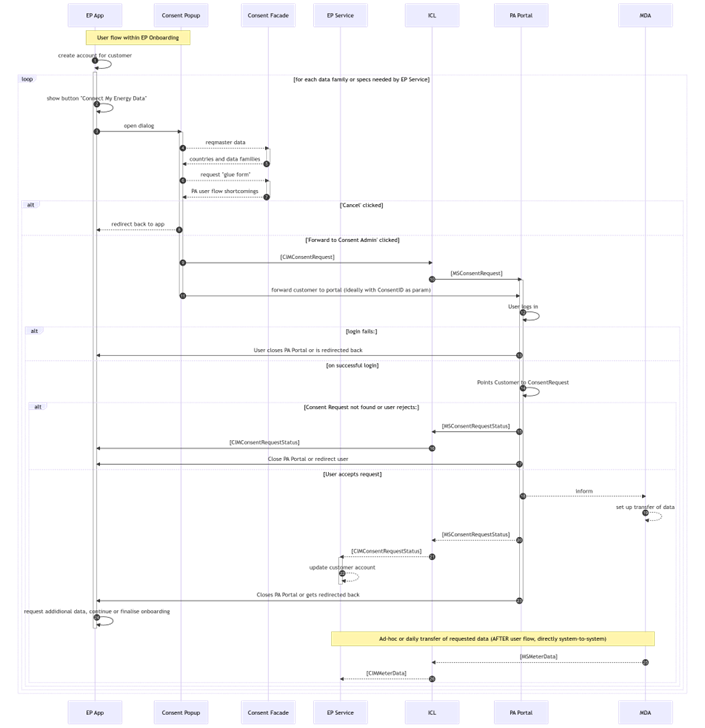

## Consent Facade

The Consent Facade component is implemented within the EDDIE framework which is under the operation of the eligible party. Upon request from the consumer, this component is responsible for triggering the process that gives the eligible party access to the consumer's energy data (either from the consumer's utility provider, or from AIIDA). The figures below describe various aspects for the consent facade.

Figure Description

Figure Description

Figure Description

Figure Description

Figure Description

Figure Description

Figure Description

.png)

Figure Description

Figure Description

Figure Description

Figure Description

Figure Description

Figure Description

