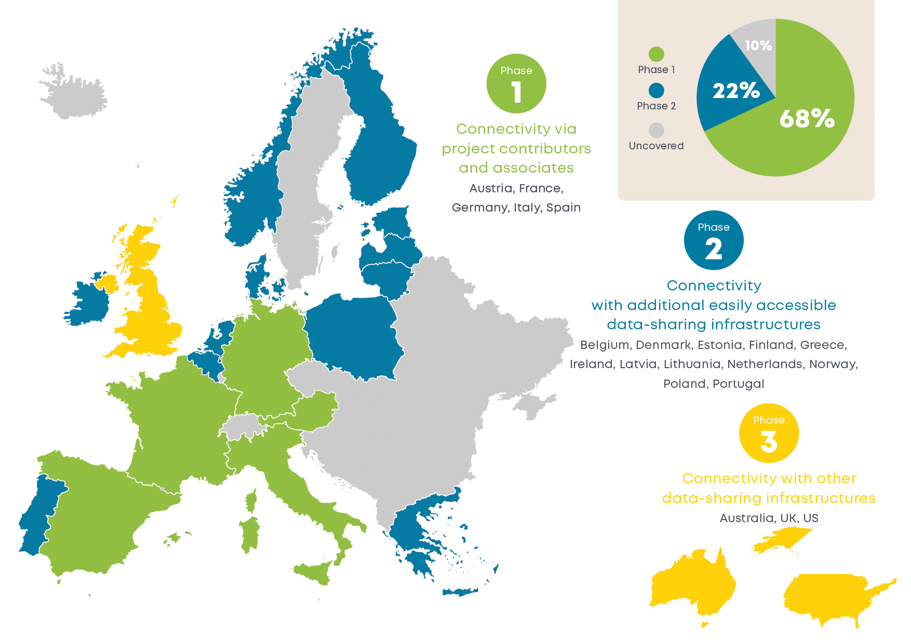

These phases are described in the table below.

| Phase | Included Countries | Comment |
|-|-|-|
| 1 | Austria, Germany, Italy, France, and Spain. | Compatibility with countries of contributors to the consortium. |
| 2 | Norway, Finland, Estonia, Latvia, Lithuania, Poland, Greece, Netherlands, Belgium, Portugal, and Ireland. | Compatibility with other countries within Europe (excluded in Phase 1). |
| 3 | Australia, United Kingdom, and United States of America | Compatibility with countries outside Europe. |

The Phase 1 will be with contributors to the consortium (already adding up to more than 69% of European metering points as estimated in section 1.2.7),
the Phase 2 will be with other data hubs not directly in the project (25%) and a Phase 3 adds data-sharing infrastructures outside Europe. So, EDDIE aims on making available more than 70% of European metering points (taking into account that not all attempted regional connectors will be feasible due to environmental factors), as shown below. 

