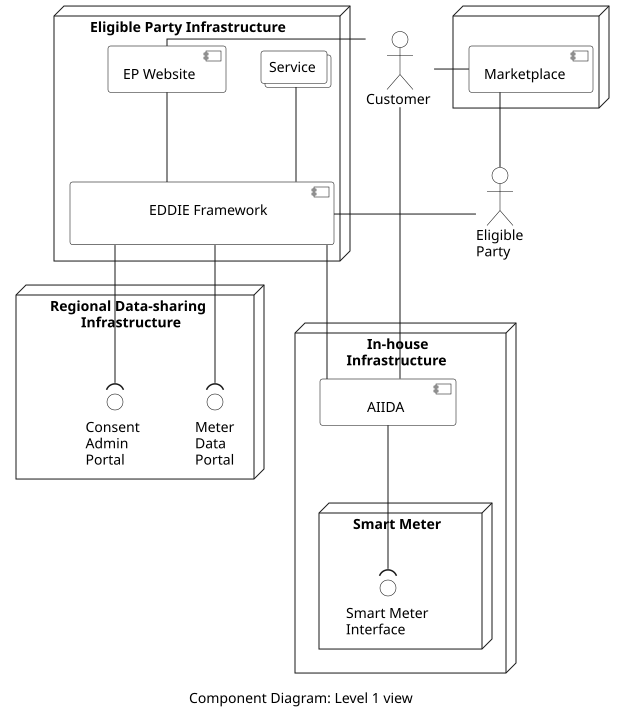
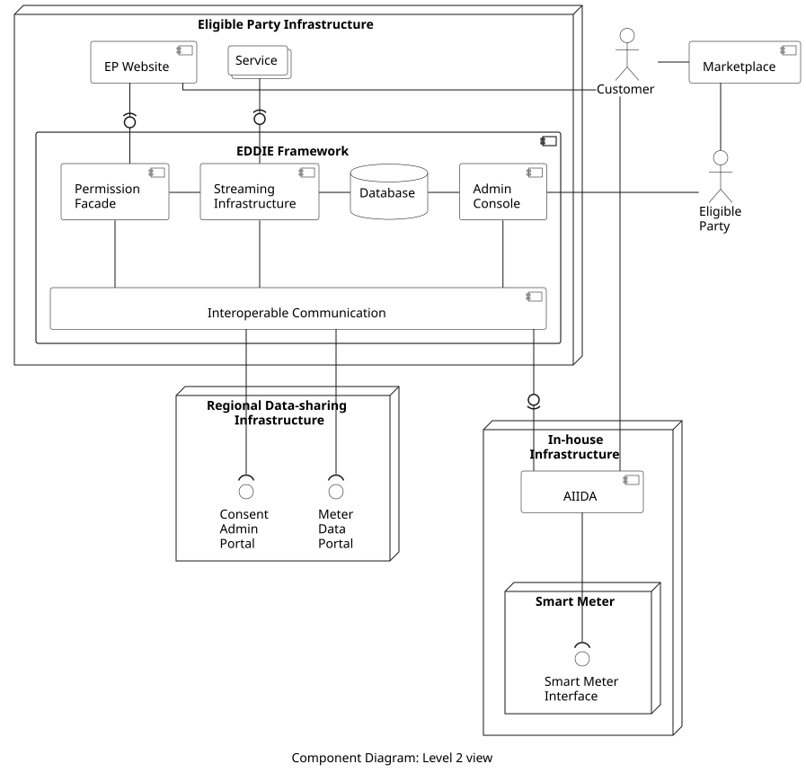

<!-- The building block view shows the static decomposition of the system
into building blocks (modules, components, subsystems, classes,
interfaces, packages, libraries, frameworks, layers, partitions, tiers,
functions, macros, operations, data structures, ...) as well as their
dependencies (relationships, associations, ...). This view is mandatory
for every architecture documentation. In analogy to a house, this is
the *floor plan*. -->

<!-- The building block view is a hierarchical collection of black boxes and
white boxes (see figure below) and their descriptions.
**Level 1** is the white box description of the overall system together
with black box descriptions of all contained building blocks.
**Level 2** zooms into some building blocks of level 1. Thus it contains
the white box description of selected building blocks of level 1,
together with black box descriptions of their internal building blocks.
**Level 3** zooms into selected building blocks of level 2, and so on. -->
<!-- 
This structure can be used:
    Motivation
    Contained Building Blocks
    Important Interfaces
    Black boxes -->

The building block view is presented through a description of the system using two levels. Level 1 shows the overall system along with all the main building blocks. Level 2 further explains the building blocks from Level 1. The building blocks of Level 2 are explained further in dedicated sections.

## Level 1 View

A high-level view of the system is shown in the component diagram below. 

### Contained Building Blocks

The eligible party operates the components that run in the Eligible Party Infrastructure node. These are also explained in the table below.

| Component | Responsibility |
| - | - |
| EP Website | This is a public website offered by an eligible party to the customers. A customer can use this website to create an account and provide their consent so that the eligible party can access their historical validated data from the Regional Data-sharing Infrastructure, and/or their real-time data from AIIDA. |
| EDDIE Framework | This component manages the customer consents, integrates the mechanisms to access energy data from multiple Regional Data-sharing Infrastructures and AIIDA instances, and consolidates energy data from potentially different regional formats to a unified format. This unified format complies with standardization activities of the energy community, and aims at being compatible with the Services. |
| Service | This component implements the logic to process the energy data from one or more customers and produce results (which are potentially shared with the customer, e.g,  through the EP Website). |

The In-house Infrastructure hosts the following component which is provided by the eligible party, but is operated by the customer.

| Component | Responsibility |
| - | - |
| AIIDA| The Administrative Interface for In-house Data Access (AIIDA) component connects to the Smart Meter in order to collect the real-time energy consumption data of a customer and send it to the EDDIE Framework. |

There is one more component of the system shown below.

| Component | Responsibility |
| - | - |
| Marketplace | The Marketplace solves the problem of discovering Services and customers. Eligible parties can advertise their Services in the Marketplace so that customers can search for them. If a customer wants to use one of these Services, this customer will be redirected to the EP Website of the respective eligible party and proceed to give consent for data access. Similarly, customers may also want to advertise their data in the Marketplace so that eligible parties can search for potential customers. The Marketplace may be operated by an eligible party or another relevant entity. |

### Interfaces

The Level 1 view of teh system includes the following external interfaces.

| Interface | Responsibility | Type |
| - | - | - |
| Consent Admin Portal | Typically operated by the permission administrator. This interface Receives requests from eligible parties for access to customer data. | HTTP (or other) |
| Meter Data Portal | Typically operated by the metered data administrator. This interface provides access to a customer's historical validated data for an eligible party that has received the appropriate consent of this customer. | HTTP (or other) |
| Smart Meter Interface | Provides access to real-time energy consumption data based on the Smart Meter readings. | P1 (or other) |

### Black Boxes

The following table describes components that are used only through their interfaces, while their internal logic is out of scope. In our system, these components are considered as black boxes.

| Component | Responsibility |
| - | - |
| Regional Data-sharing Infrastructure | Operated by, e.g., a metered data administrator, and/or a permission administrator, and/or other relevant entities. It is used only through the interfaces (i.e., the Consent Admin Portal and the Meter Data Portal) which are described above. |
| Smart meter | Provided by a utility company for constant metering of the energy consumption of a customer. Is is used only through the Smart Meter Interface which is described above. |

## Level 2 View

The Level 2 view of the system is shown in the component diagram below. 

### Contained Building Blocks

The EDDIE Framework includes the following components.

| Component | Responsibility |
| - | - |
| Permission Facade | Receives, stores, and manages the consent of the customers for access to both historical and real-time data (regardless of the customer's country).
| Streaming Infrastructure | Facilitates the distribution of the data from the EDDIE Framework to the Services in a publish-subscribe fashion. |
| Database | Stores configuration information and metadata regarding the eligible party, the customers, the consents, and the state of the EDDIE Framework. |
| Admin Console | Provides an overview of active/inactive Services, consents and requests for data access, along with configuration options such as terminate, restart, etc. |
| Interoperable Communication | Integrates the mechanisms to interact with the Regional Data-sharing Infrastructures for requesting consents and for accessing energy data. Also it establishes communication with multiple AIIDA instances for accessing real-time data from Smart Meters. | 

<!-- The AIIDA component includes the following components.

| Component | Responsibility |
| - | - |
| pending | - | -->

### Interfaces

The Level 2 view introduces the following interfaces.

| Provided From | Consumed By | Type |
| - | - | - |
| Permission Facade | EP Website | HTTP |
| Streaming Infrastructure | Services | Kafka |
| Interoperable Communication | AIIDA | Kafka |

## Component Description

> More detailed information on the components of the system (and their data models) is provided [here](./components/components.md).

## Regional Hurdles

> While implementing interactions for access to historical validated data, various hurdles stemming from limitations of the Regional Data-sharing Infrastructures are identified. These hurdles are documented [here](./development/development.md) to be shared with the energy community.
