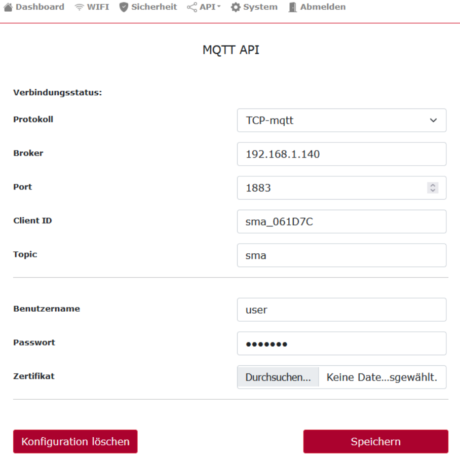
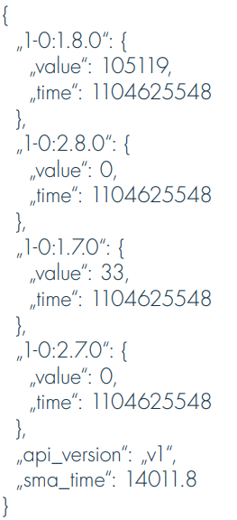
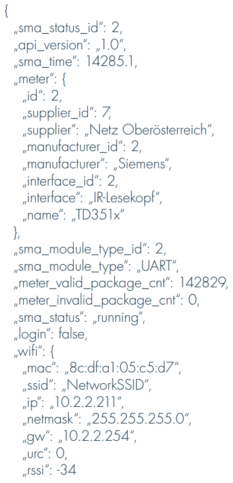

In Austria, AIIDA is deployed as depicted in the following figure.

As shown in the figure, an additional device named the Adaptor is used. The adaptor is a device that attaches to the Smart Meter to simplify the acquisition of real-time consumption data. The specification of the utilized adaptor is described [here](https://oesterreichsenergie.at/fileadmin/user_upload/Oesterreichs_Energie/Publikationsdatenbank/Leitfaden/2022/Datenblatt_Smart_Meter_Adapter_V7_20220808.pdf). The adaptor collects the real-time consumption data via the P1 interface and transmits this data to AIIDA over WiFI via the MQTT protocol. The adaptor is configurable via a Web Interface as shown below.

The energy consumption data that is sent to AIIDA formatted using JSON as shown below:

It is also possible to request status information which is also formatted using JSON as shown below:

