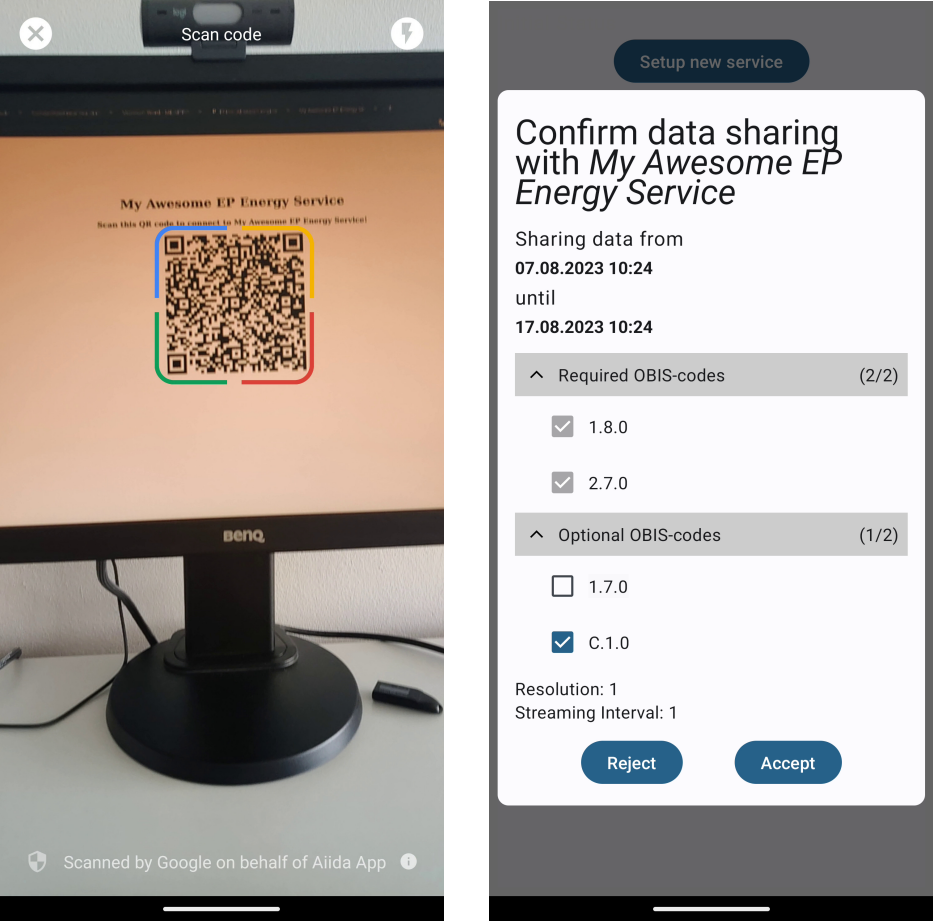

## Overview

The AIIDA App is a smartphone application for the customer to access and configure the AIIDA Backend, similar to the AIIDA Frontend. Since the AIIDA Backend runs on the in-house device connected to the house's local area network, the AIIDA App needs to be on the same network as well. This is done for security purposes so that only the customer can configure the AIIDA BAckend. The AIIDA App is shown in the figure below.

The AIIDA App enables the following functionalities:

1. Scan a QR code from the EP website to configure the connection to the Smart Meter and the EDDIE Framework automatically.
1. View active and inactive connections/permissions.
1. Manage existing connections/permissions (e.g., activate, deactivate, delete, etc.)

When scanning a QR code from the EP Website, the AIIDA App shows the configurations to the customer who is expected to either accept the configurations and allow the sharing of the data, or reject the configuration and prohibit the sharing of the data. This is shown in the figure below.

