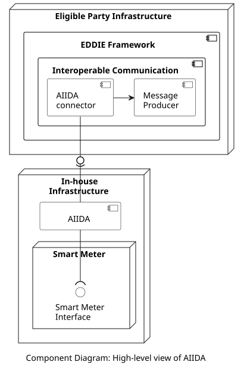

## Overview

AIIDA (Administrative Interface for In-house Data Access) is responsible for establishing the consent of the customer regarding access to real-time data from the customer's Smart Meter. Also, for acquiring the real-time data from the Smart Meter and sending it to the AIIDA Connector of the Interoperable Communication component in the EDDIE Framework. The high-level view of AIIDA is shown in the figure below.

Since the Smart Meter device may be different in each country, AIIDA may need to operate differently as well, in order to adapt to the specificities of each Smart Meter. For this reason, the deployment of AIIDA is presented in the table below based for each supported country. 

| Country | Section | 
|-|-|
| Austria | [Link](./countries/aiida-austria/aiida-austria.md) |
| France | [Link](./countries/aiida-france/aiida-france.md) |

## Data Models

Information about the AIIDA data model is provided [here](../../../data-models/aiida/aiida.md).