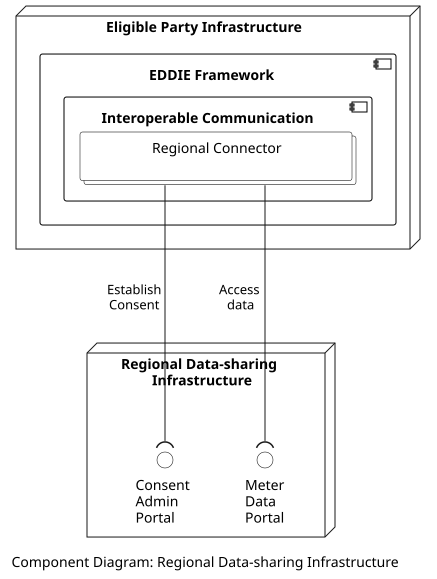

## Overview

The Consent Admin Portal is the interface of the Regional Data-sharing Infrastructure that handles the authorization of the customers for sharing their historical validated energy consumption data with eligible parties, i.e., the customer consent. The Consent Admin Portal is operated by a designated country-specific entity, referred to as the permission administrator. For this reason, the Regional Data-sharing Infrastructure can function differently in each country (e.g., using different communication protocols such as HTTP, or AS4, and authentication processes such as token-based, or account-based). Consequently, the naming of the components and processes of the Regional Data-sharing Infrastructures can also vary per country. Nevertheless, the common point of all Regional Data-sharing Infrastructures is that they all have at least two prime features: one interface for establishing consent, and one interface for accessing data. For this reason, we use the terms Consent Admin Portal and Meter Data Portal for interactions regarding establishing consent, and accessing data, respectively. Since the Regional Data-sharing Infrastructure can differ per country, one Regional Connector is implemented to interact with the Consent Admin Portal and the Meter Data Portal of each country, as shown in the figure below. Importantly, the notation of the Regional Connector block is a "collection" block -indicating a multitude of Regional Connectors. 

## Data Models

> Information about the Consent Admin Portal data model is provided [here](../../../data-models/consent-admin-portal/consent-admin-portal.md).
