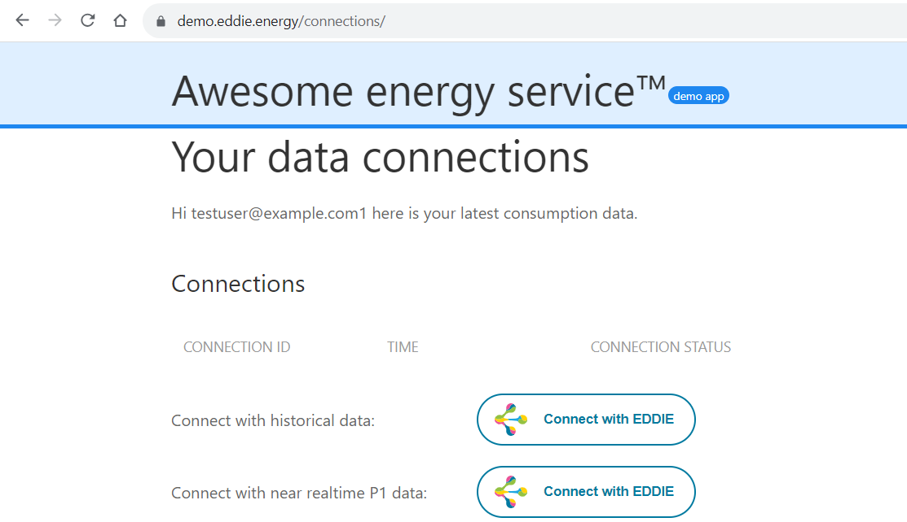
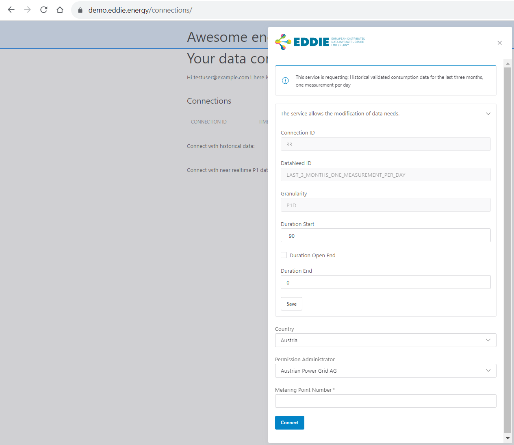
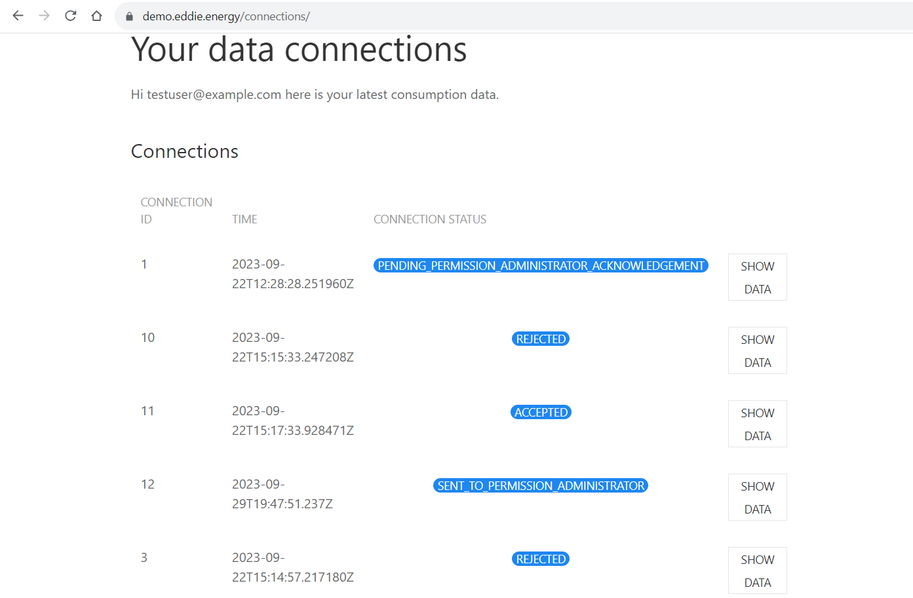

## Overview

The EP Website is a frontend application offered by the eligible party to the customers. The main role of the EP Website is to establish that the consent of a customer for data access to historical validated and/or real-time consumption data is given to the EDDIE Framework. After that, the EDDIE Framework accesses this data and forwards it to the Services for processing. The outcome of the processing can be potentially shared with the customer, e.g., through the EP website. A diagram of these components is shown below.

## Frontend Functionality

At the EP Website, a customer may need to create an account and log in. After that, the customer can select a [Service](../service/service.md), and click a button "Connect with EDDIE" to consent and share historical validated and/or real-time energy data with this Service (through the EDDIE Framework), as shown in the figure below. 

Then, the EP Website offers a form to collect all the necessary information for establishing the customer consent. This includes the specifics of the requested data (e.g., daily measurements of the past 3 months), and the specifics of permission administrator (e.g., the metering point number), as shown in the figure below. 

Since the necessary information to establish the customer consent may vary per permissions administrator (and country), the EP Website follows the microfrontends architectural pattern, and uses the Permission Facade component to request different input data from the customer based on their country and permission administrator. 

In addition to requesting consents, the EP Website may show to the customer an overview of the active/inactive consents that have been given in the past, along with a connection status for each consent, as shown in the figure below.

Notably, while the Permission Facade microfrontend is provided by the EDDIE Framework so that all customers have the same user-experience when giving their consent, the EP Website is not within the scope of the EDDIE Framework. Thus, it is assumed that every eligible party implements their own EP Website and integrate the Permission Facade microfrontend for the purpose of getting the customer consent.