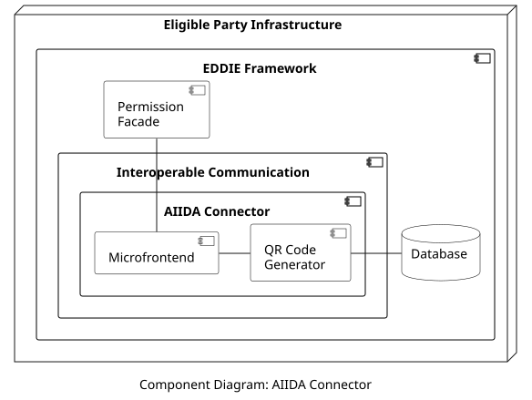

## Overview

The AIIDA Connector is responsible for enabling AIIDA instances to connect with the EDDIE Framework. To achieve that, the AIIDA Connector includes a QR Code Generator. This component generates a QR code that encodes the necessary information needed by AIIDA to send data to the Streaming Infrastructure component. Specifically, the encoded information includes a host URL and a connection ID. The former is needed for AIIDA to reach the API of the Streaming Infrastructure component, and the latter is needed to associate a specific AIIDA instance with a customer. The QR code is shown to the customer via the EP Website which shows the Permission Facade that conveys the AIIDA Connector's Microfrontend displaying the QR code. The customer is then expected to import the QR code into AIIDA (e.g., using the [AIIDA app](../../aiida/aiida.md)). The QR Code Generator also stores the customer's data and the connection ID to the Database. The components that interact with the AIIDA Connector are shown below.

## Components

The included components are the following:

| Component | Responsibility | 
| - | - |
| Microfrontend | Includes the frontend elements to provide a form to the customer for collecting the required data to establish the customer consent for access to real-time data. Upon filling out this form, the Microfrontend shows the customer the QR code. | 
| QR Code Generator | Generates a QR code for establishing the connection between AIIDA and the Streaming Infrastructure component. Moreover, it stores all the customer data regarding the access to real-time data to the Database. | 

## Data Models

> Information about the AIIDA Connector data model is provided [here](../../../../data-models/permission-facade/permission-facade.md).