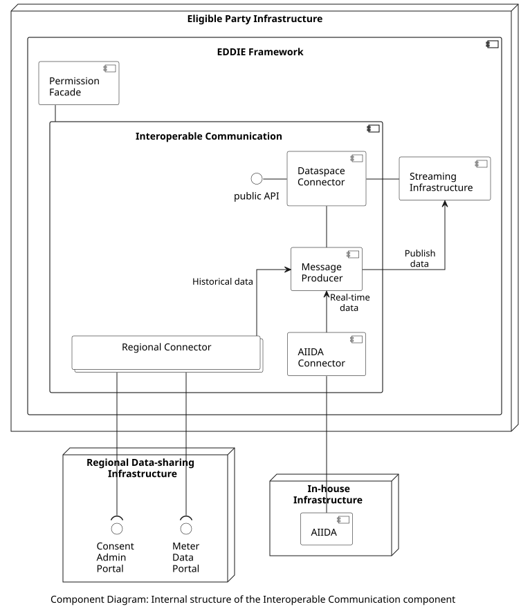

## Overview

The Interoperable Communication component is responsible for the communication with external components, e.g., with the Regional Data-sharing Infrastructures, and with AIIDA instances. Primarily, it accesses data from these external components and publishes it to the Streaming Infrastructure to be sent to the Services. To this end, the Interoperable Communication includes a collection of connectors that access data and send it to the Message Producer. Subsequently, the Message Producer publishes the data to the [Streaming Infrastructure](../streaming-infr/streaming-infr.md). The internal structure of the Interoperable Communication component is shown in the figure below.

## Components

The included components are the following:

| Component | Responsibility | Section |
| - | - | - |
| Regional Connectors | Includes various country-specific regional connectors. Each one of these connectors implements the functionality to access the APIs of the corresponding Regional Data-sharing Infrastructure. | [Link](./regional-connectors/regional-connectors.md)|
| AIIDA Connector | Implements the functionality to connect with AIIDA instances of In-house devices and access real-time data of customers. | [Link](./aiida-connector/aiida-connector.md)|
| Dataspace Connector | Implements the functionality to access data from a dataspace, e.g., to collect other data than energy consumption, which is useful for the Services. | [Link](./dataspace-connector/dataspace-connector.md)|
| Message Producer  | Receives data from a connector and publishes it to the Streaming Infrastructure. | [Link](./message-producer/message-producer.md) |

## Interfaces

The included interfaces are the following:

| Provided by | Consumed by | Type |
| - | - | - |
| Dataspace Connector | Public API | HTTP (or other)|
| AIIDA Connector | AIIDA | Kafka |

## Data Models

> Information about the Interoperable Communication data model is provided [here](../../../data-models/interoperable-comm/interoperable-comm.md).
