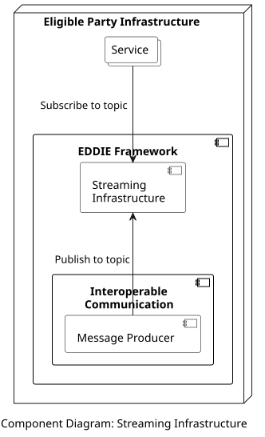

## Overview

The Streaming Infrastructure component distributes the incoming energy data of the customers (received from the Message Producer) to the Services of the eligible party. Since an eligible party can have a large number of customers and Services, the distribution of the data takes place using the publish/subscribe architectural pattern. Consequently, each Service receives only the data of customers who have provided consent for sharing their data with this Service. A component diagram of these components is shown below.

The Streaming Infrastructure component is implemented using Apache Kafka. When the eligible party creates a new Service, a corresponding topic is created in Kafka. The new Service then subscribes to this topic. Afterward, when the customer gives consent for access to their data for a specific Service, this data is acquired by the Interoperable Communication component and is published to the topic of that particular Service (by the Message Producer). This way, every customer shares data only with the services they want to use.

## Data Models

> Information about the Streaming Infrastructure data model is provided [here](../../../data-models/streaming-infr/streaming-infr.md).
