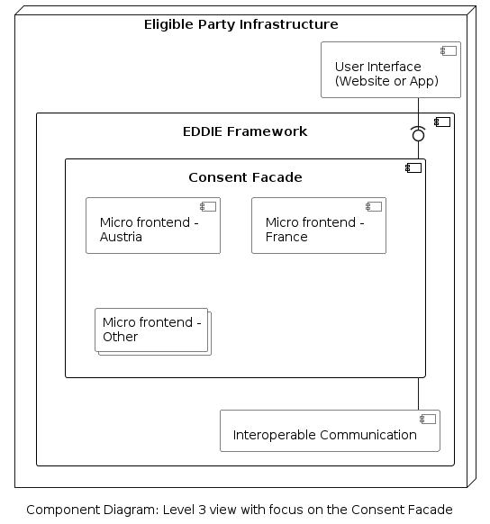

#### Consent Facade

The internal structure of the Consent Facade component is shown below. The Consent Facade is a collection of [micro frontends](../08-crosscut-concepts/architectural-patterns/micro-frontends/micro-frontends.md). Each micro frontend provides the necessary frontend elements to collect the required information for acquiring the consumer consent in a specific country.

The included components are the following.

| Component | Responsibility |
| - | - |
| Micro Frontend | Provides the necessary frontent elements to the EP Website. Since every country may require different information for establishing consent, one micro frontent component is needed for each supported country. |