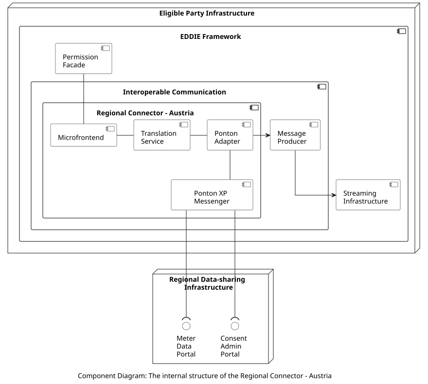

## Overview

The internal structure of the Regional Connector - Austria is shown below.

The included components are the following.

| Component | Responsibility | Section |
| - | - | - |
| Microfrontend | Provides the necessary frontend elements to the EP Website (through the Permission Facade) for establishing the customer consent in Austria. The specific information needed by each country is presented [here](../../../../../data-models/permission-facade/permission-facade.md). | TBD |
| Translation Service | Receives the required information of the customer from the Permission Facade and translates it to the appropriate format to be sent to the Ponton Adapter. | TBD |
| Ponton Adapter | Translates information to/from the formats used by Ponton XP Messenger. | TBD |
| Ponton XP Messenger  | This is a messaging solution by [Ponton GmbH](https://www.ponton.de/ponton-xp) that implements the AS4 protocol for communication with the Regional Data-sharing Infrastructure of Austria. | TBD |

A class diagram with the implementation model of this component is provided [here](./figures/class-diagram-regional-connector-austria.png).

## Data Models

> Information about the Regional Connector - Austria data model is provided [here](../../../../../data-models/meter-data-portal/country-data-models/data-model-austria/data-model-austria.md).

