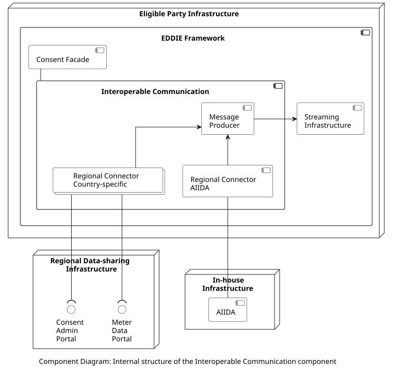

#### Interoperable Communication

The internal structure of the Interoperable Communication component is shown below. The Interoperable Communication is a collection of regional connectors that send data to the Message Producer. Each regional connector implements the functionality to access the APIs of the Regional Data-sharing Infrastructure of a specific country, or AIIDA.

The included components are the following:

| Component | Responsibility | Link |
| - | - | - |
| Regional Connector | Implements the functionality to access the APIs of a country-specific Regional Data-sharing Infrastructure, or AIIDA. | [Link](./regional-connectors/regional-connectors.md)|
| Message Producer  | Receives energy data from a regional connector and publishes it to the Streaming Infrastructure. |  |

