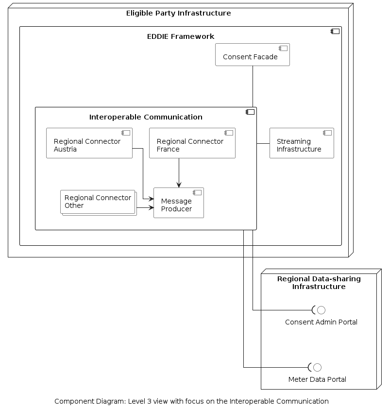

#### Interoperable Communication

The internal structure of the Interoperable Communication component is shown below. The Interoperable Communication is a collection of regional connectors. Each regional connector implements the functionality to access the APIs of the Regional Data-sharing Infrastructure of a specific country.

The included components are the following.

| Component | Responsibility |
| - | - |
| Regional Connector | Implements the functionality to access the APIs of a country-specific Regional Data-sharing Infrastructure, e.g., to request the consent of the consumer. |
| Message Producer  | Receives energy data from a regional connector and publishes it to the Streaming Infrastructure. |

#### Regional Connector - Austria

The internal structure of the Regional Connector - Austria is shown below. An implementation model for this component is provided [here](./data-models/data-model-regional-connector-austria/data-model-regional-connector-austria.md).

The included components are the following.

| Component | Responsibility |
| - | - |
| Translation Service | Receives the required information of the consumer from the Consent Facade and translates it to appropriate format. |
| Ponton XP Messenger  | This is a messaging solution by [Ponton GmbH](https://www.ponton.de/ponton-xp) for communication with the Regional Data-sharing Infrastructure in Austria which is called [EDA](https://www.eda.at/?lang=en). |
| Ponton Adapter | Translates infromation to/from the formats used by Ponton XP Messenger. |

#### Regional Connector - France

An implementation model for this component is provided [here](./data-models/data-model-regional-connector-france/data-model-regional-connector-france.md).