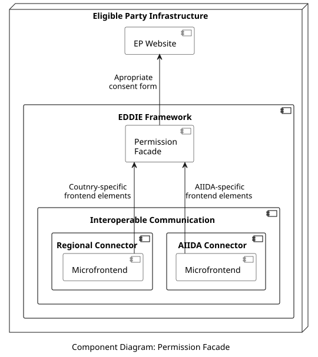

## Overview

The Permission Facade is a backend application that coordinates the [microfrontends](../../../08-crosscut-concepts/architectural-patterns/micro-frontends/micro-frontends.md) used in the [EP Website](../ep-website/ep-website.md) so that the customers are given a consent form that complies with the regulations of their country. To achieve this, when a customer choses their country in the EP Website, the Permission Facade selects the corresponding microfrontend for this country from the Regional Connectors of the [Interoperable Communication](../interoperable-communication/interoperable-communication.md) component. If the customer wants to share real-time data, then the microfrontend of the AIIDA Connector is selected. Thus, the Permission Facade selects the microfrontend which provides the necessary frontend elements that offer the customer an appropriate consent form to collect the required information based on the customer's country. This is also shown in the component diagram below.

> The specific information that is needed by each country (or AIIDA) is summarized [here](../../data-models/consent-facade-interface/consent-facade-interface.md).

