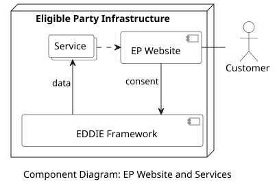

## Overview

Each eligible party can use Services for processing the historical validated and/or real-time data retrieved by the EDDIE Framework. The eligible party is responsible for the deployment and operation of the Services. However, it is not the goal of the EDDIE project to focus on developing Services. To connect with the EDDIE Framework and access the data, every Service needs to subscribe to the [Streaming Infrastructure](../streaming-infr/streaming-infr.md). The Streaming Infrastructure is a publish/subscribe messaging system that is implemented using Apache Kafka to offer to the Services the energy data in a CIM-compliant data model that is discussed [here](../../data-models/meter-data-portal/meter-data-portal.md). A diagram of these components is shown below.

Essentially, the EP Website collects the required information from the customer for establishing the customer consent. This information is sent to the EDDIE Framework which uses this information to access the customer data. This data is then sent to the Services for processing. The outcome of the processing may be sent back to the EP Website to the shared with the customer.

## Data Models

> Information about the Service data model is provided [here](../../data-models/service/service.md).