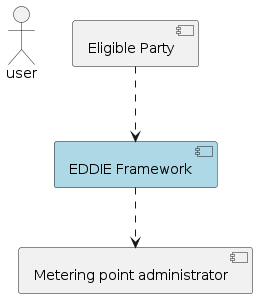
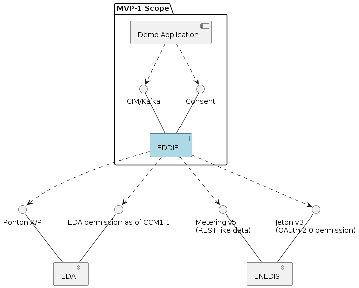

>
> This description of the MVP-1 scope and context is derived from the activities in the development team. It should
> summarize the understanding of the development team. If there are differing views and opinions please feel free
> to point it out.
>

## Business Context View
The business context is basically the same for the MVP-1 as for the final framework, except that the in-house data
sources are not considered yet. The EDDIE framework is used to enable an eligible party to receive and process
historically validated metering data on behalf of a user which is also customer of a metering point administrato.

<!-- ```plantuml
@startuml
:user:

[EDDIE Framework] as Eddie #lightblue

[Eligible Party] as Ep
Ep ..> Eddie

component [Metering point administrator] as Mpa
Eddie ..> Mpa

@enduml
``` -->

<div align="center">

</div>


## Functional Scope
The main objective of the MVP-1 is creating a software product that eligible parties can use to connect to permission administrators (PA) and metered data administrators (MDAs).
Eligible parties need to be able to
- offer their customers the possibility to connect their data from their MDA to the eligible party (EP), giving their permission through a PA.
- provide their customers a means to provide their consent to the data sharing between the PA and EP
- receive validated historical metering and consumption data from at least two MPAs in a CIM-62325-451 "My Energy Data" compliant data format. If the related data exchange is currently not covered by the IEC-62325-451 standard, proposals shall be made to extend the standard.
  - [EDA](../dev-EDA/dev-EDA.md) (Austria)
  - [ENEDIS](../dev-Enedis/dev-Enedis.md) (France)
- see a demo application as an example how to integrate the EDDIE Framework into their own solutions (which display the data received from the MDA)

## Nonfunctional Scope
In addition to the implemnentation of a software, things need to be done to achieve that primary objective:
- setup of development infrastructure like source code repositories, CI/CD pipelines, webservers
- get access to the choosen MDAs
- define the external interface of the EDDIE framework for eligible parties for metering data & consent
- modeling tools
- collect master data for metering point and permission administrators
- decide on and prepare tools for modeling

## Technical Context View
For the MVP-1 scope, the EDDIE Framework needs to be partly implemented along with a demo application for showcasing it's functionality.
The interfaces that EDDIE offers need to be specified and provided. The interfaces from the metering point administrators are already
in productive use and will be used as they are currently provided.

The interfaces of these systems are described in subsequent sections:
  - [EDA](../dev-EDA/dev-EDA.md) (Austria)
  - [ENEDIS](../dev-Enedis/dev-Enedis.md) (France)

<!-- ```plantuml
@startuml
folder "MVP-1 Scope" {
    [EDDIE] as Eddie #lightblue
    () "CIM/Kafka" as EddieData
    () "Consent" as EddieConsent
    EddieData -- Eddie
    EddieConsent -- Eddie

    [Demo Application] as Demo
    Demo ..> EddieData
    Demo ..> EddieConsent
}

component [EDA] as Eda
() "Ponton X/P" as EdaData
() "EDA permission as of CCM1.1" as EdaConsent
EdaData -- Eda
EdaConsent -- Eda
Eddie ..> EdaData
Eddie ..> EdaConsent

component [ENEDIS] as Enedis
() "Metering v5\n(REST-like data)" as EnedisData
() "Jeton v3\n(OAuth 2.0 permission)" as EnedisConsent
EnedisData -- Enedis
EnedisConsent -- Enedis
Eddie ..> EnedisData
Eddie ..> EnedisConsent
@enduml
``` -->

<div align="center">

</div>