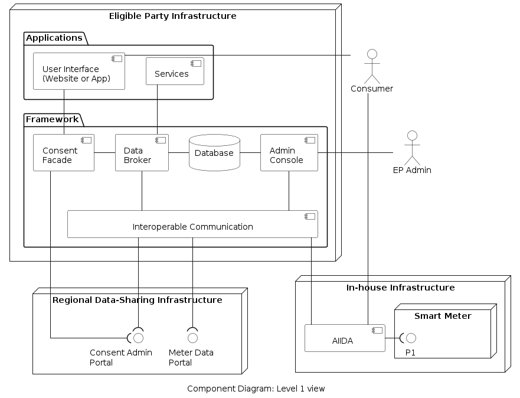
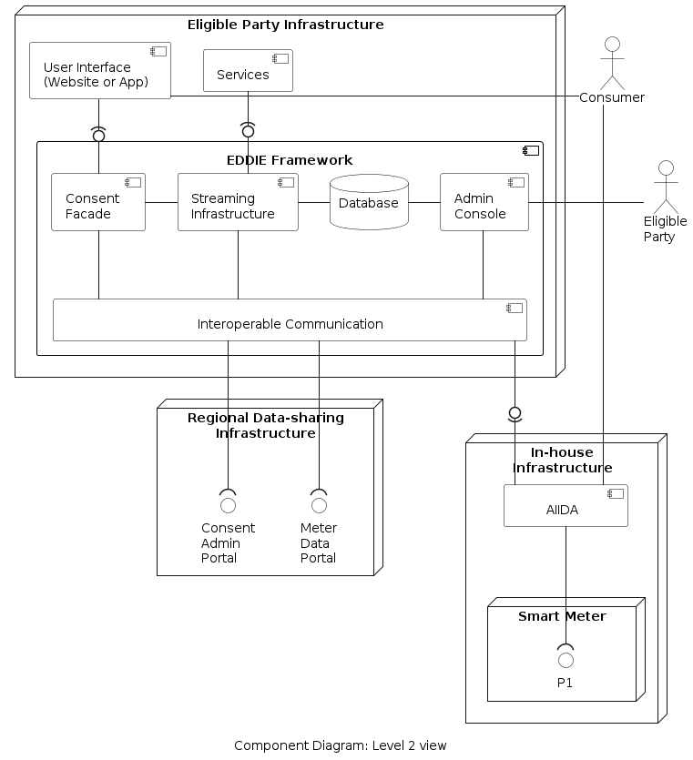
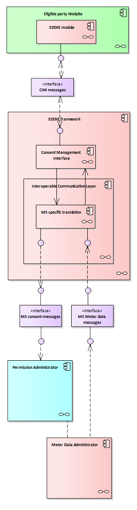
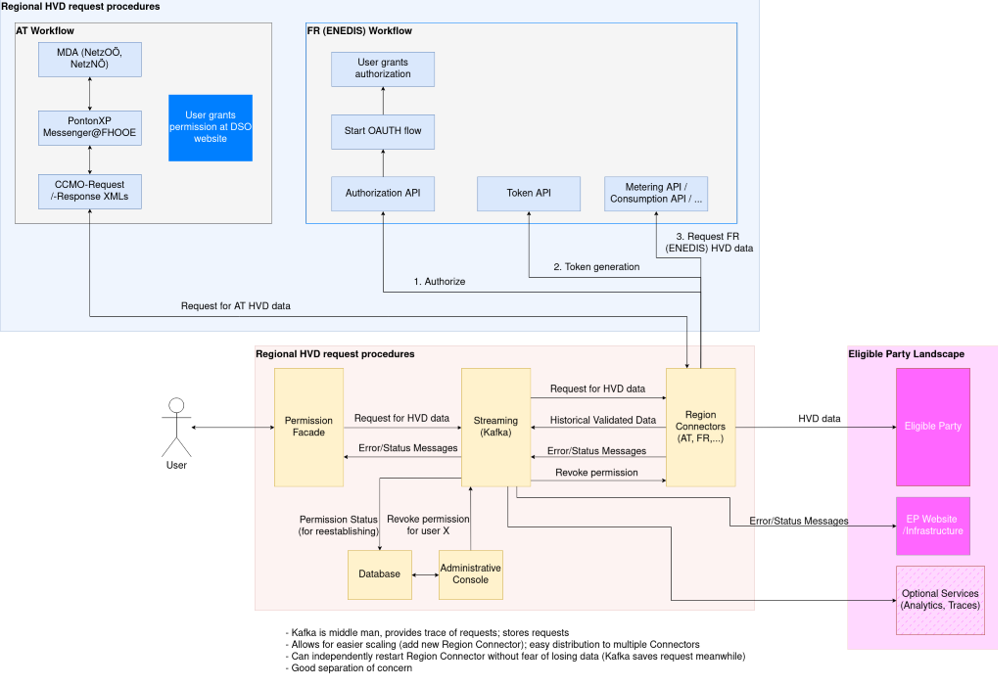

<!-- The building block view shows the static decomposition of the system
into building blocks (modules, components, subsystems, classes,
interfaces, packages, libraries, frameworks, layers, partitions, tiers,
functions, macros, operations, data structures, ...) as well as their
dependencies (relationships, associations, ...). This view is mandatory
for every architecture documentation. In analogy to a house, this is
the *floor plan*. -->

<!-- The building block view is a hierarchical collection of black boxes and
white boxes (see figure below) and their descriptions.
**Level 1** is the white box description of the overall system together
with black box descriptions of all contained building blocks.
**Level 2** zooms into some building blocks of level 1. Thus it contains
the white box description of selected building blocks of level 1,
together with black box descriptions of their internal building blocks.
**Level 3** zooms into selected building blocks of level 2, and so on. -->
<!-- 
This structure can be used:
    Motivation
    Contained Building Blocks
    Important Interfaces
    Black boxes -->

The building block view is presented through a description of the system using levels. Level 1 shows the overall system along with all the main building blocks. Level 2 focuses on some building blocks from Level 1. Level 3 focuses on building blocks from Level 3 and so on. To decompose the system into building blocks we have used functional decomposition on the main functionality of the framework.

**Notably, concrete details about the system from a product development perspective are presented [here](./development/dev-mvp1/dev-mvp1.md).**

## Level 1

A high-level view of the system is shown in the component diagram below. 

### Contained Building Blocks

The eligible party manages the following components.

| Component | Responsibility |
| - | - |
| User Interface | Entry point for consumers to provide their consent. |
| Services | Implement logic to process the energy data. |
| EDDIE Framework | Manages the consumer consents, consolidates energy data from different Regional Data-sharing Infrastructures a unified format. |

The In-house Infrastructure hosts the following components.

| Component | Responsibility |
| - | - |
| AIIDA| Gets real-time data from the smart meter. |

### Interfaces

The Level 1 view includes the following interfaces.

| Interface | Responsibility | Type| Data Model |
| - | - | - | - |
| Consent Admin Portal | Receives requests from eligible parties for access to consumer data. | HTTP (or other) | [Link](./data-models/data-model-consent-admin-portal/data-model-consent-admin-portal.md) |
| Meter Data Portal | Provides historical data to the eligible party (with appropriate consent) | HTTP (or other) | [Link](./data-models/data-model-meter-data-portal/data-model-meter-data-portal.md) |
| P1 | Provides access to real-time energy consumption data | P1 | [Link](./data-models/data-model-p1-interface/data-model-p1-interface.md) |

### Black Boxes

| Component | Function |
| - | - |
| Regional Data-sharing Infrastructure | Operated by the utility provider or a metered data administrator. It is used only through the interfaces (described above). |
| Smart meter | Provided by the utility provider. Is is used only through the interface (described above). |

## Level 2

The Level 2 view of the system is shown in the component diagram below. 

### Contained Building Blocks

The EDDIE Framework includes the following components.

| Component | Responsibility | Data Model |
| - | - | - |
| Consent Facade | Manages and stores the consent of the consumers. |  |
| Streaming Infrastructure | Handles the communication among internal and external components |  |
| Database | Stores information about consents, state, and data. |  [Master Data](./data-models/data-model-master-data/data-model-master-data.md) |
| Admin Console | Entry point for the eligible party to register with regional data-sharing infrastructure (if necessary). |  |
| Interoperable Communication | Translates messages/data from different Regional Data-sharing Infrastructures (e.g., from different countries) to a unified format. |  |

<!-- The AIIDA component includes the following components.

| Component | Responsibility |
| - | - |
| pending | - | -->

### Interfaces

The Level 2 view introduces the following interfaces.

| Provided From | Consumed By | Type | Data Model |
| - | - | - | - |
| Consent Facade | User Interface | HTTP | [Link](./data-models/data-model-consent-facade-interface/data-model-consent-facade-interface.md) |
| Streaming Infrastructure | Services | Kafka | [Link](./data-models/data-model-data-broker-interface/data-model-data-broker-interface.md) |
| Interoperable Communication | AIIDA | Kafka | [Link](./data-models/data-model-inter-comm-aiida-interface/data-model-inter-comm-aiida-interface.md) |

### Black Boxes

No introduced black boxes in Level 2.

<!-- ## Level 3

The Level 3 view of the system is shown in the component diagram below. 

### Contained Building Blocks

### Interfaces

### Black Boxes -->

<!-- 

 -->

<!-- 
The eligible party manages the following components.

| Component | Responsibility |
| - | - |
| User Interface | Entry point for consumers to provide their consent. |
| Services | Implement logic to process the energy data. |
| EDDIE Framework | Manages the consumer consents, consolidates energy data from different Regional Data-sharing Infrastructures a unified format. |

The In-house Infrastructure hosts the following components.

| Component | Responsibility |
| - | - |
| AIIDA| Gets real-time data from the smart meter. |
 -->

<!-- 
The Level 1 view includes the following interfaces.

| Interface | Responsibility | Type| Data Model |
| - | - | - | - |
| Consent Admin Portal | Receives requests from eligible parties for access to consumer data. | HTTP (or other) | [Link](./data-models/consent-admin-portal/consent-admin-portal.md) |
| Meter Data Portal | Provides historical data to the eligible party (with appropriate consent) | HTTP (or other) | [Link](./data-models/meter-data-portal/meter-data-portal.md) |
| P1 | Provides access to real-time energy consumption data | P1 | [Link](./data-models/p1-interface/p1-interface.md) |
 -->

<!-- 
| Component | Function |
| - | - |
| Regional Data-sharing Infrastructure | Operated by the utility provider or a metered data administrator. It is used only through the interfaces (described above). |
| Smart meter | Provided by the utility provider. Is is used only through the interface (described above). | -->

<!-- ## Consent Facade

TBD

The figure below shows the components of the system that are relevant to the consent facade.

`add figure description here`

A different view of the system which includes two countries is shown below.

`add figure description here`

### AT - Austria \<\_building block x.1\_\>

Specifies the internal structure of *building block x.1*.

*\<white box template>*

### DE - Germany \<\_building block x.2\_\>

*\<white box template>*

### FR - France \<\_building block x.2\_\>

*\<white box template>*

### IT - Italy \<\_building block y.1\_\>

*\<white box template>* -->