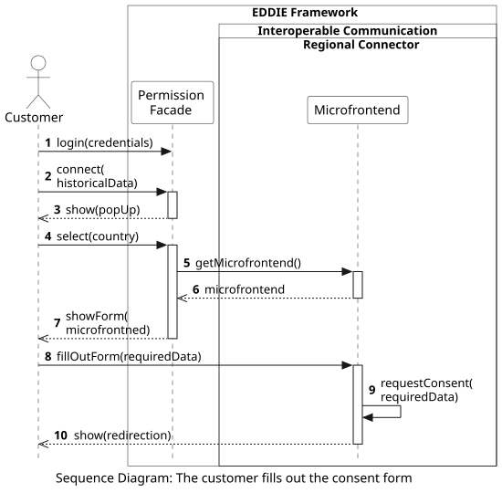

## Overview

The following workflow shows the process of a customer that fills out a consent form for access to their historical validated energy consumption data. Since this form may need to be different based on the regulations of each country (e.g., due to different required data such as metering point numbers, or national identification numbers), a specific process takes place to provide all customers with a uniform and intuitive experience regarding giving their consent.

 

This workflow includes the following steps:
1. The customer logs in at the Permission Facade.
2. The customer clicks the button to share their historical validated data.
3. The Permission Facade shows a pop up window for the customer to select their country. In this pop up window, the customer can also select their permission administrator and the service they want to use.
4. The customer fills out the required data in the pop up window.
5. The Permission Facade requests the microfrontend from the Regional Connector of the selected country.
6. The microfrontend is sent to the Permission Facade.
7. The Permission Facade shows the consent form to the customer based on the microfrontend.
8. The customer fills out the consent form with the required data. The required data that is needed for each country is presented [here](../../../../05-building-block-view/data-models/permission-facade/permission-facade.md).
9. The Microfrontend forwards the required data to the internal components of the Regional Connector which initiate the interactions with the Regional Data-sharing Infrastructure to request access to the historical validated data of the customer. Since these interactions vary based on the selected country, the respective workflows are presented in separate sections [here](../../../1-access-historical-data/1-access-historical-data.md).
10. The Microfrontend shows to the customer that the consent is requested, and further information about a redirection to the website of the permission administrator where the customer may need to log in and approve the consent request.