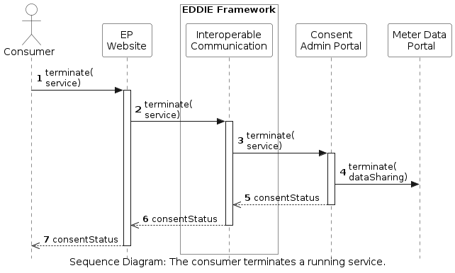

<!-- Add runtime diagram or textual description of the scenario/
Add a description of the notable aspects of the interactions between the building block instances depicted in this diagram. -->

## Consumer terminates a service

The workflow of a consumer that terminates an active service is shown below.

 

This workflow includes the following steps:

1. The consumer accesses the EP Website and clicks to terminate the service.
1. The EP Website forwards this to the Interoperable Communication.
1. The Interoperable communication sends a request to terminate the service to the consent administrator.
1. The consent administrator stops the data sharing from the meter data administrator. Since the involved components of this step do not belong to EDDIE, this step is out of scope. However, EDDIE depends on the timely execution of this step.
1. The status of the consent is returned to the Interoperable communication.
1. The status of the consent is returned to the EP Website.
1. The status of the consent is returned to the consumer.