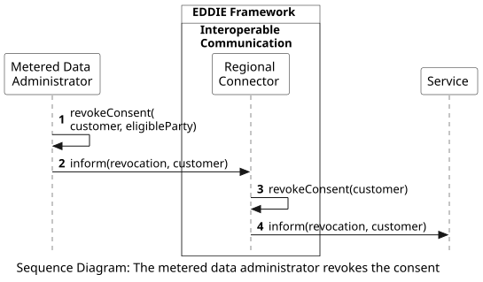

## Overview

The following workflow shows the process of the metered data administrator, i.e., the entity that operates the Meter Data Portal, revoking the consent of the customer for data access. This process may start for various reasons, e.g., because the customer moved out of their residence, and a new customer now uses the metering point. In this case, the metered data administrator may initiate this process.

 

This workflow includes the following steps:
1. The metered data administrator revokes the consent of the customer. This step may also include interactions between the metered data administrator and the permission administrator which are out of the scope of EDDIE.
2. The metered data administrator informs the Regional Connector that the customer consent has been revoked.
3. The Regional Connector applies the revocation, e.g., by updating the relevant fields in the Database.
4. The Regional Connector informs the service of the customer that the customer has revoked their consent.
