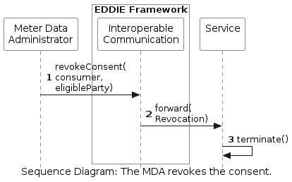

<!-- Add runtime diagram or textual description of the scenario/
Add a description of the notable aspects of the interactions between the building block instances depicted in this diagram. -->

## The MDA revokes the consent of a consumer to an eligible party

The workflow of a Meter Data Administrator (MDA) that revokes the consent of a consumer to an eligible party (for access to historical validated data) is shown below. A more detailed view of this process can be viewed [here](../../eligible-party-gets-historical-data/eddie-implementing-act/eddie-implementing-act.md). Notably, the MDA is part of the Regional Data-sharing Infrastructure and provides the [Meter Data Portal Interface](../../../05-building-block-view/index.md).

 

This workflow includes the following steps:

1. The MDA sends a request for consent revocation to the Interoperable Communication.
1. The Interoperable Communication forwards the revocation to the service.
1. The service terminates.
