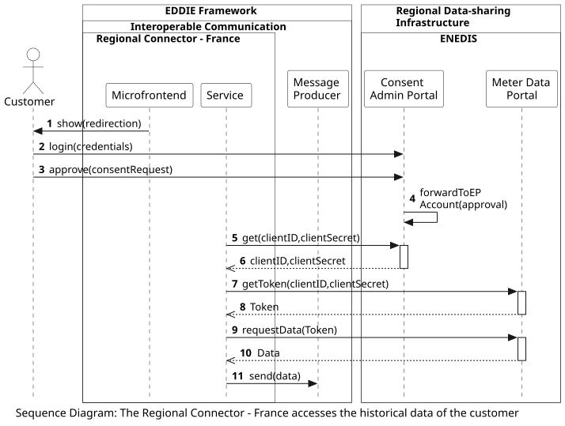

## Overview

The following workflow shows the process of the eligible party accessing the historical validated data of a customer in France. This process starts when the customer approves the consent request at the Regional Data-sharing Infrastructure. 
<!-- The workflow of requesting the customer consent is presented [here](../request-consent-france/request-consent-france.md).  -->

<!-- TBD The Service within the Regional Connector has to be replaced by the appropriate components -->

 

This workflow includes the following steps:
1. The Microfrontend shows the customer a redirection to the website of the permission administrator (which is operated by Enedis, in France).
2. The customer logs in to the Consent Admin Portal.
3. The customer approves the consent request at the Consent Admin Portal.
4. The Consent Admin Portal forwards the approval to the account of the eligible party, along with information about the metering point of the customer. 
5.	The Interoperable Communication component requests the clientID and clientSecret from the Consent Admin Portal.
6.	The clientID and clientSecret are sent to the Interoperable Communication.
7.	The Interoperable Communication uses the clientID and the clientSecret to get a valid token from the Meter Data Portal (that is also operated by Enedis, in France).
8.	A valid token is returned to the Interoperable Communication (as long as clientID and clientSecret are valid and the customer has accepted the corresponding consent request).
9.	The Interoperable Communication requests the energy data using this Token.
10.	The data is sent to the Interoperable Communication.
11.	The Interoperable Communication sends the data to the Message Producer.

<!-- After the data has been received by the Message Producer, another workflow takes place to send this data to a Service. This workflow is presented [here](../send-data-to-service-regional-connector/send-data-to-service-regional-connector.md). -->

