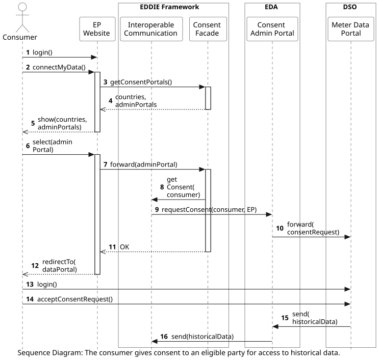
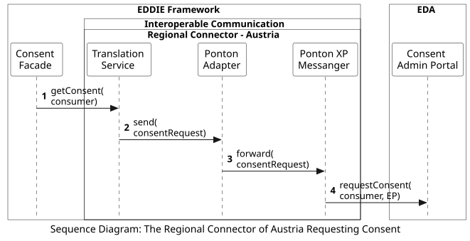
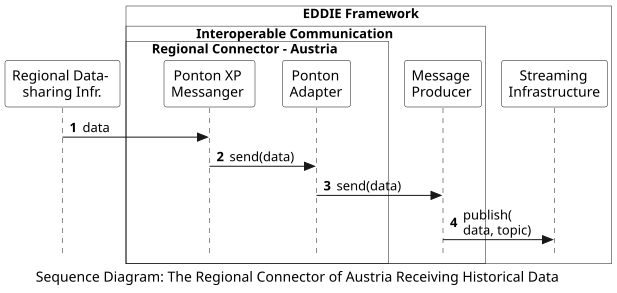

<!-- Add runtime diagram or textual description of the scenario/
Add a description of the notable aspects of the interactions between the building block instances depicted in this diagram. -->

## The Consumer Gives Consent to Eligible Party for Access to Historical Data

The workflow of a consumer that provides their consent to an eligible party for access to historical data from a Meter Data Portal is shown below:

 

This workflow includes the following steps:
1. The consumer visits the website of an eligible party and logs in to their account (upon registration if necessary).
2. The consumer clicks the button "Connect my data".
3. A request is sent from the website to the Consent Facade to create a list of the countries (and respective consent admin portals) that the eligible party operates in.
4. The list of countries and Consent Admin Portals is sent back to the website. To find the countries and respective consent admin portals, the consent facade searches the framework's database. The available countries are stored in the database during the eligible party registration. 
5. The list is shown to the consumer.
6. The consumer selects their country and Consent Admin Portal.
7. The selected Consent Admin Portal is sent to the Consent Facade.
8. The Consent Facade asks the Interoperable Communication to set up a consent request in the selected Consent Admin Portal.
9. The Interoperable Communication sends a consent request to the Consent Admin Portal. Steps 8 and 9 are also shown below in a separate sequence diagram.
10. The Consent Admin Portal forwards the consent request to the Meter Data Portal.
11. The Consumer is notified that the consent request has been made via the EP Website.
12. The consumer is redirected to the Meter Data Portal.
13. The consumer logs in to the Meter Data Portal (after having registered).
14. The consumer accepts the consent request created in Step 10 (for access to their historical data). The acceptance is forwarded Interoperable Communication component (via the communication established in Step 9) which makes this acceptance visible to the user through the EP Website.
15. The Meter Data Portal forwards the acceptance to the Consent Admin Portal. 
16. The Meter Data Portal sends the data to the Interoperable Communication. This step is also shown below in a separate sequence diagram that details the internal process of the Interoperable communication.

The steps that include exclusively components that do not belong to EDDIE (e.g., Step 10, 15) are out of scope. However, EDDIE depends on the timely execution of these steps.

Some of these steps that require additional explanations are discussed in the subsections below. A more detailed view of this workflow is also shown [here](./figures/get-historical-data-austria-detailed.png).

> After the data has been received by the EDDIE Framework, another internal workflow takes place to send the data to a service. This workflow is shown [here](../eddie-framework-offers-data-to-service/eddie-framework-offers-data-to-service.md).

### Steps 8 and 9: Internal Process of the Interoperable Communication to Request the Consent

A more detailed view showing the workflow of the Interoperable Communication is depicted below:

 

This workflow includes the following steps:
1. The Consent Facade which includes the micro frontend of Austria collects the required information from the consumer, and sends this information to the Translation Service.
2. The Translation Service converts this information to a consent request and sends this request to the Ponton Adapter.
3. The Ponton Adapter forwards the consent request to the Ponton XP Messanger.
4. The Ponton XP Messanger sets up a consent request at the Consent Admin Portal. The consumer then has to access the Consent Admin Portal and accept the consent request by clicking the appropriate button.

### Step 15: Internal Process of the Interoperable Communication When Receiving Historical Data

A more detailed view showing the workflow of the Interoperable Communication is depicted below:

 

This workflow includes the following steps:
1. The Regional Data-sharing Infrastructure sends the historical validated data to the Ponton XP messenger.
2. The Ponton XP messenger forwards the data to the Ponton Adapter.
3. The Ponton Adapter sends the data to the Message Producer.
4. The Message Producer converts the data to the appropriate data model utilized internally by the EDDIE Framework. This data model is CIM-compliant as discussed [here](../../../05-building-block-view/data-models/data-model-meter-data-portal/data-model-meter-data-portal.md). The data is then published to the Streaming Infrastructure.