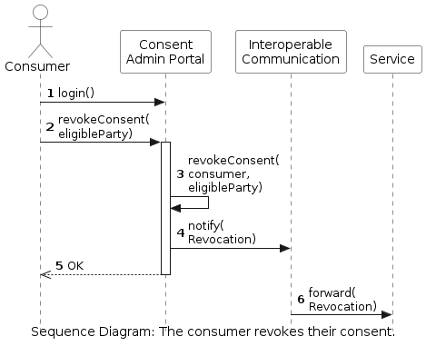

<!-- Add runtime diagram or textual description of the scenario/
Add a description of the notable aspects of the interactions between the building block instances depicted in this diagram. -->

## Consumer revokes consent from an eligible party

The workflow of a consumer that revokes their consent from an eligible party for access to historical validated data is shown below. A more detailed view of this process can be viewed [here](../consent-management/consent-management.md).

 

This workflow includes the following steps:

1. The consumer logs in to the website of the consent administrator.
1. The consumer clicks to revoke the consent of a specific eligible party.
1. The consent administrator revokes the consent. Since the involved components of this step do not belong to EDDIE, this step is out of scope. However, EDDIE depends on the timely execution of this step.
1. The consent administrator notifies the Interoperable Communication about the revocation of the consent.
1. The consent administrator responds to the consumer that the consent has been revoked.
1. The Interoperable Communication notifies the service that the consent has been revoked.
