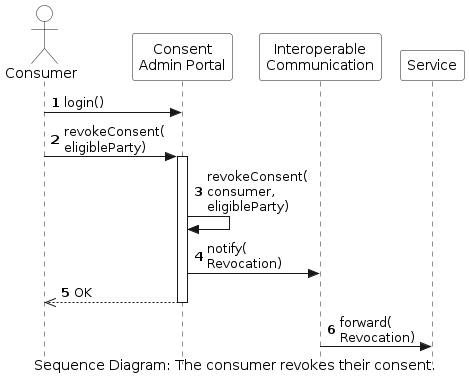

<!-- Add runtime diagram or textual description of the scenario/
Add a description of the notable aspects of the interactions between the building block instances depicted in this diagram. -->

## Consumer revokes consent from an eligible party

The workflow of a consumer that revokes their consent from an eligible party for access to historical validated data is shown below. A more detailed view of this process can be viewed [here](../consent-management/consent-management.md).

 

This workflow includes the following steps:

1. 
1.