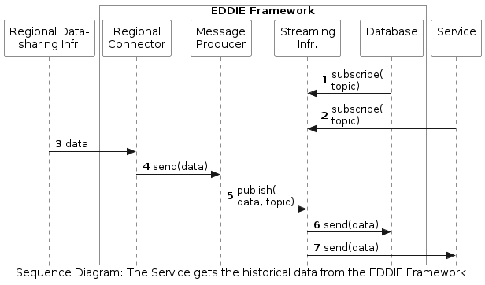

<!-- Add runtime diagram or textual description of the scenario/
Add a description of the notable aspects of the interactions between the building block instances depicted in this diagram. -->

## The Service Gets the Historical Data from the EDDIE Framework

The workflow of the historical validated data from the arrival to the EDDIE Framework until it is sent to a Service for processing.

 

This workflow includes the following steps:
1. The Database of the EDDIE Framework subscribes to the Streaming Infrastructure (in order to receive the historical data when it is available).
1. The Service subscribes to the Streaming Infrastructure (to receive the historical data when it is available).
1. The historical validated data is sent from the Regional Data-sharing Infrastructure to the [Regional Connector](../../../05-building-block-view/index.md#interoperable-communication).
1. The Regional Connector forwards the data to the [Message Producer](../../../05-building-block-view/index.md#interoperable-communication).
1. The Message Producer publishes the data to a specific topic at the Streaming Infrastructure.
1. The EDDIE Database receives the data because of the subscription to the same topic (Step 1). 
1. The Service receives the data because of the subscription to the same topic (Step 2).

**Important Node:** At the moment various alternatives for Step 6 and 7 are considered, so these steps may change. The most important alternatives are:

- Only the Service gets the data from the Streaming Infrastructure (not the Database). This means that no historical data is saved in the Database of the EDDIE Framework. Instead, the historical data is stored only in the Streaming Infrastructure (temporarily).
- Only the Database gets the data from the Streaming Infrastructure (not the Service). The Service then gets the data from the Database (either directly or through a topic of the Streaming Infrastructure). This means that all the data is stored in the Databased of the EDDIE Framework