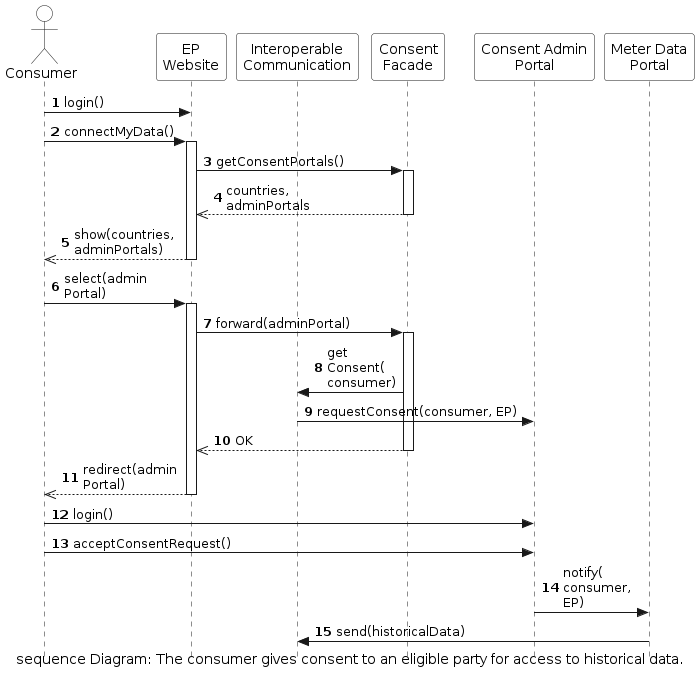

<!-- The runtime view describes concrete behavior and interactions of the
system's building blocks in form of scenarios from the following areas:
-   important use cases or features: how do building blocks execute
    them?
-   interactions at critical external interfaces: how do building blocks
    cooperate with users and neighboring systems?
-   operation and administration: launch, start-up, stop
-   error and exception scenarios
Remark: The main criterion for the choice of possible scenarios
(sequences, workflows) is their **architectural relevance**. It is
**not** important to describe a large number of scenarios. You should
rather document a representative selection. -->

<!-- There are many notations for describing scenarios, e.g.
-   numbered list of steps (in natural language)
-   activity diagrams or flow charts
-   sequence diagrams
-   BPMN or EPCs (event process chains)
-   state machines -->

The runtime view focuses on interactions among the system's components. The goal of this section is to describe representative and important workflows that occur during the runtime of the system. The table below shows an overview of these workflows:

| Workflow | Involved Actors | Involved Components | Link | 
|-|-|-|-|
| Consent management | Consumer, eligible party | AIIDA, Consent Facade, Consent Admin Portal, Interoperable Communication  | [Section](#consent-management) |
| Eligible party registration | Eligible party | Admin console, consent admin portal, interoperable communication | [Section](#eligible-party-registration)  |

## Consent Management 

<!-- Add runtime diagram or textual description of the scenario/
Add a description of the notable aspects of the interactions between the building block instances depicted in this diagram. -->

### The Consumer Gives Consent to Eligible Party for Access to Historical Data

The workflow of a consumer that provides their consent to an eligible party for access to historical data from a meter data portal is shown below:

 

This workflow includes the following steps:
1. The consumer visits the website of an eligible party and logs in to their account (upon registration if necessary).
1. The consumer clicks the button "Connect my data".
1. A request is sent from the website to the Consent Facade to create a list of the countries (and respective consent admin portals) that the eligible party operates in.
1. The list of countries and Consent Admin Portals is sent back to the website. To find the countries and respective consent admin portals, the consent facade searches the framework's database. The available countries are stored in the database during the workflow of the [eligible party registration](). 
1. The list is shown to the consumer.
1. The consumer selects their country and consent admin portal.
1. The selected Consent Admin Portal is sent to the Consent Facade.
1. The Consent Facade asks the Interoperable Communication to set up a consent request in the selected Consent Admin Portal.
1. The Interoperable Communication sends a consent request to the Consent Admin Portal.
1. The website is notified that the consent request is made.
1. The consumer is redirected to the Consent Admin Portal.
1. The consumer logs in to the Consent Admin Portal website (using cross-national credentials or upon registration).
1. The consumer accepts the consent request created in Step 9 (for access to their historical data).
1. The Consent Admin Portal informs the Meter Data Portal to allow access to the data for the eligible party.
1. The Meter Data Portal sends the data to the eligible party. The way whereby the data is sent depends on the individual meter data portal, and also on the host country. For example, the transmission of the data may be based on pull or push (which are handled by the the Interoperable Communication).

### The Consumer Gives Consent to Eligible Party for Access to Real-time Data from AIIDA

The workflow of a consumer that provides their consent to an eligible party to access real-time data from AIIDA is shown below:

### Etc.

## Eligible Party Registration

The workflow of a consumer that provides their consent to an eligible party to access real-time data from AIIDA is shown below:

