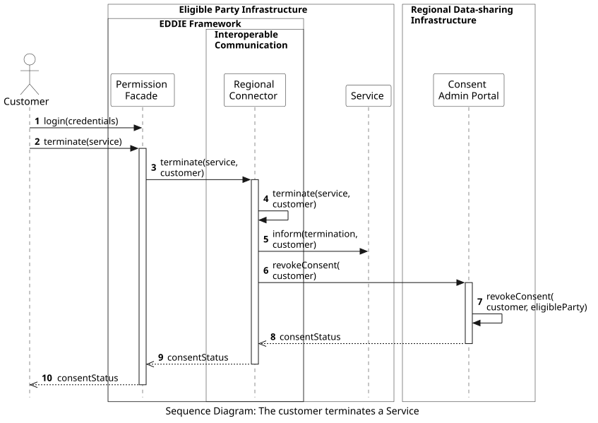

## Overview

The following workflow shows the process of the customer terminating a Service, and consequently, revoking their consent for data access. This process starts with the Customer accessing the Permission Facade, i.e., the website of the eligible party.

 

This workflow includes the following steps:
1. The customer logs in to the Permission Facade.
2. The customer clicks to terminate a running Service.
3. The Permission Facade forwards the termination to the Regional Connector of the customer's country.
4. The Regional Connector applies the termination, e.g., by updating the relevant fields in the Database. Notably, upon termination, the Service stops receiving data from this particular customer. However, the Service may still run and collect data from other customers.
5. The Regional Connector informs the Service about the termination.
6. The Regional Connector revokes the customer consent from the Consent Admin Portal.
7. The Consent Admin Portal applies the consent revocation. This step may include additional actions that are out of the scope of EDDIE, e.g., informing the Meter Data Portal about the revocation.
8. The status of the revoked consent is sent back to the Regional Connector.
9. The status of the revoked consent is sent to the Permission Facade.
10. The Permission Facade shows to the customer the status of the consent.