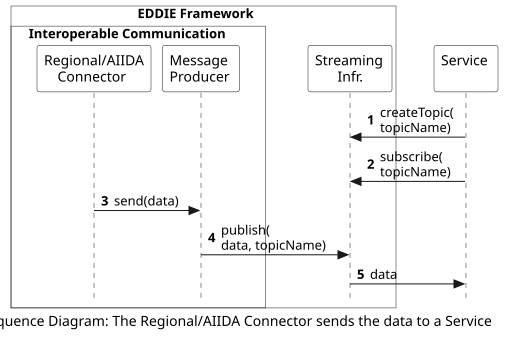

## Overview

The following workflow shows the process of the Message Producer sending data from the Regional/AIIDA Connector to a Service. This process starts when the Message Producer receives the data. The workflow of how the data is sent to the Message Producer varies, e.g., based on country, and is presented [here](../../06-runtime-view.md). 

 

This workflow includes the following steps:
1. Upon creation, the Service creates a new topic in the Streaming Infrastructure.
2. The Service subscribes to this topic at the Streaming Infrastructure. When a customer wants to use a Service (and gives consent for data access), the information about which service each customer uses is stored. TBD
3. When the data of a customer is accessed by the Regional/AIIDA Connector, it is sent to the Message Producer.
4. The Message Producer publishes the data on the topic of the Service that the customer has selected (at the Streaming Infrastructure).
5. The Service (that has subscribed to the topic) receives the data from the Streaming Infrastructure.

<!-- 
TBD
These steps may change in the future.
 -->
