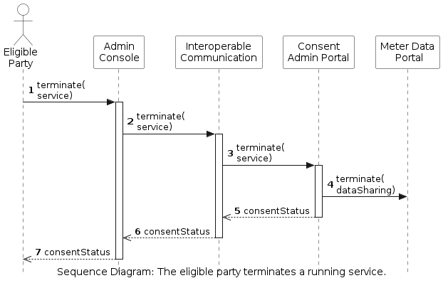

<!-- Add runtime diagram or textual description of the scenario/
Add a description of the notable aspects of the interactions between the building block instances depicted in this diagram. -->

## Eligible party terminates a service

The workflow of an eligible party that terminates an active service is shown below. A more detailed view of this process can be viewed [here](../consent-management/consent-management.md).

 

This workflow includes the following steps:

1. The eligible party accesses the admin console and clicks to terminate the service.
1. The admin console forwards this to the Interoperable Communication.
1. The Interoperable communication sends a request to terminate the service to the consent administrator.
1. The consent administrator stops the data sharing from the meter data administrator.
1. The status of the consent is returned to the Interoperable communication.
1. The status of the consent is returned to the Admin Console.
1. The status of the consent is returned to the eligible party.