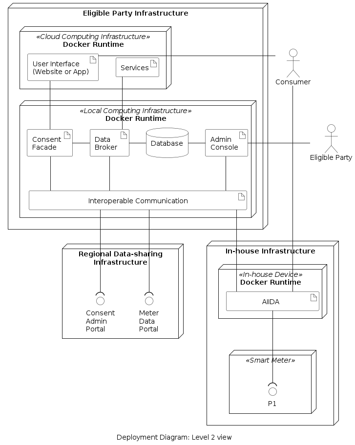
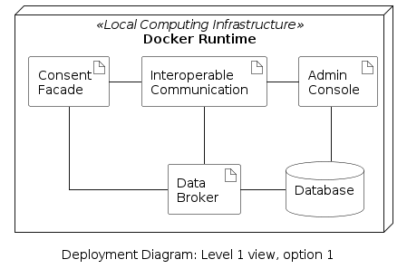
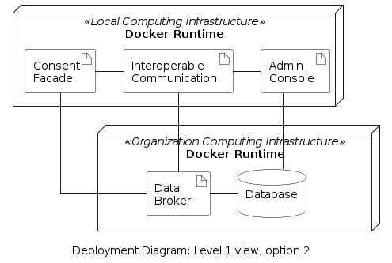
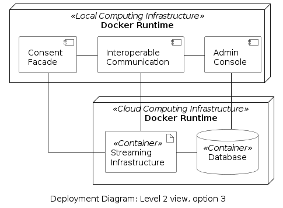

<!-- The deployment view describes:
1.  technical infrastructure used to execute your system, with
    infrastructure elements like geographical locations, environments,
    computers, processors, channels and net topologies as well as other
    infrastructure elements and
2.  mapping of (software) building blocks to that infrastructure
    elements.
Often systems are executed in different environments, e.g. development
environment, test environment, production environment. In such cases you
should document all relevant environments.

From a software perspective it is sufficient to capture only those
elements of an infrastructure that are needed to show a deployment of
your building blocks. -->

<!-- Maybe a highest level deployment diagram is already contained in section
3.2. as technical context with your own infrastructure as ONE black box.
In this section one can zoom into this black box using additional
deployment diagrams:
Describe (usually in a combination of diagrams, tables, and text):
-   distribution of a system to multiple locations, environments,
    computers, processors, .., as well as physical connections between
    them
-   important justifications or motivations for this deployment
    structure
-   quality and/or performance features of this infrastructure
-   mapping of software artifacts to elements of this infrastructure --> 

## Overview

The deployment view of the system focuses on the utilized technical infrastructure, and shows deployment diagrams that depict where the internal components of the system run. The prime way to deploy the these components is shown in the figure below.

 

The system runs across three nodes which are described in the table below.

| Node | Description |
|-|-|
|Eligible Party Infrastructure | This is operated by the eligible party. The Local Computing Infrastructure is used for running the framework which is deployed locally on the premises of the eligible party.|
|Regional Data-sharing Infrastructure | This is operated by the Metered Data Administrator. |
|In-house Infrastructure | This node is operated by the consumer. It includes an in-house device (e.g., a Raspberry Pi computer) and the smart meter. |

## Deployment Options

Specifically for the deployment of the framework, i.e., the node Local Computing Infrastructure shown above, two additional deployment options are possible. The original deployment is shown below isolated from the rest of the system.

 

Two additional options are shown below.

| Option 2 | Option 3 |
|-|-|
|

|

|

The motivation for all 3 options is shown in the table below.
| Option | Motivation |
|-|-|
| 1 |  Represents a deployment scenario as to be run on a laptop or on a standard server. All the environment is delivered with a simple console command and running in an orchestrated pre-defined virtual infrastructure configured by the EDDIE deployment scripts. |
| 2 | This would be a typical scenario in a corporate environment, that has its own database/data warehouse infrastructure running on-premises, as well as – probably – already a data streaming infrastructure in place, that it intends to re-use and manage with existing staff. |
| 3 | This would be typical for a “purchase” or “download” of EDDIE through a cloud market place. It works similar to Option 2, with the difference that is utilises the integrated, cloud-native structures for managed databases and managed data streaming infrastructure. |

<!-- ## Infrastructure Level 3 -->
