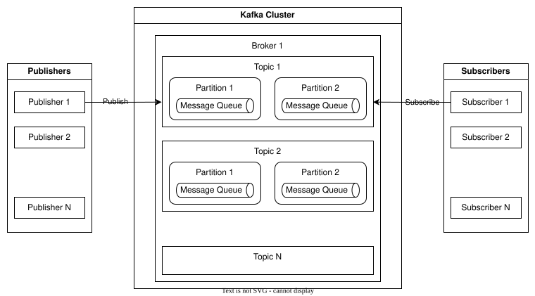

## Definition

The publish/subscribe architectural pattern describes the design of the communication among different components of software systems. This pattern enables certain components, i.e., the Publishers, to publish messages containing information to a broker. The broker is responsible for distributing these messages to multiple Subscribers that have subscribed to receive specific types of information. Subscribers do not need to know about the Publishers directly; they only need to subscribe to the topics they are interested in. This loose coupling between Publishers and Subscribers allows for flexible and scalable communication because the system components can interact without direct dependencies, making the system modular and adaptable to changes.

## Relevance

Publish/subscribe is an architectural pattern that can be of use to the EDDIE Framework when distributing energy data from many energy consumers to many services. The energy data that is aggregated by the EDDIE Framework is first published to the Streaming Infrastructure (which is implemented using the Apache Kafka publish/subscribe framework). Then, this data is sent to Subscribers that are the Services of the eligible party. An overview of Kafka is shown in the figure below:

This figure includes the following components:

| Component | Description |
|-|-|
| Publisher | Publishers are responsible for sending messages to the Kafka Cluster, and specifically, to Topics. A Publisher can be an application, a system, or a service supplying data to the Kafka Cluster. |
| Topic | Topics are logical categories that represent streams of messages coming from one or more Publishers. Each topic can be split into multiple Partitions to allow for parallel processing and distribution of data across multiple Brokers. |
| Partition | Partitions are the basic unit of parallelism in Kafka. They allow for distributing the workload and increasing the throughput. Each partition is ordered and immutable. Messages within a partition are assigned an incremental offset for keeping track of which messages have been written and which ones have been read. Each Partition contains data for one Topic exclusively. |
| Broker | Brokers store the published messages. Each broker maintains a subset of the overall Topics and their Partitions. Brokers handle data replication, storage, and retrieval. They also manage metadata about Topics and Partitions. |
| Subscriber | Subscribers consume messages by subscribing to specific Topics, and receiving messages from the partitions of these topics. |
| Kafka Cluster | The deployment of the Kafka framework including all the components in one or more Brokers that may be deployed in the same or a different node. |

In the EDDIE Framework, when the eligible party creates a Service, a corresponding Topic is created in the Streaming Infrastructure component, and this Service becomes a Subscriber. Afterward, when the consumer gives consent for access to their data (for a specific Service), this data is acquired by the EDDIE Framework, and is published to that particular Topic, so that the Service can receive it.

## Motivation

Apache Kafka, specifically, makes a great choice for the Steaming Infrastructure component due to its fitting internal architecture, its broad community support, and the existing rich documentation. 

Alternatives to Apache Kafka are:
- MQTT (Message Queuing Telemetry Transport):  MQTT is a lightweight messaging protocol designed for communication between devices in constrained environments, especially in the context of the Internet of Things (IoT). MQTT follows the publish/subscribe pattern, allowing devices to publish messages to specific topics and to subscribe to topics in order to receive relevant messages. It is designed to conserve network bandwidth and handle unreliable or low-bandwidth networks, making it well-suited for scenarios where resources are limited and efficient communication is essential. MQTT is commonly used for transmitting sensor data, telemetry, and commands in IoT applications. Existing MQTT implementations like Eclipse Mosquitto and MQTTnet could be used as alternatives. 
- RabbitMQ: RabbitMQ is a message broker that implements the Advanced Message Queuing Protocol (AMQP), the Streaming Text Oriented Messaging Protocol (STOMP), and the MQTT, and supports various messaging patterns, including publish/subscribe and point-to-point communication. RabbitMQ acts as an intermediary that routes messages between senders and receivers using customizable routing rules and message queues. RabbitMQ is used for decoupling components in distributed systems, managing work queues, and enabling asynchronous communication between various parts of an application or even across different applications.
- ZeroMQ (ØMQ) is a high-performance messaging library that provides lightweight communication patterns for distributed applications. It offers building blocks for creating custom communication protocols without the overhead of a traditional message broker. ZeroMQ focuses on fast and asynchronous communication, allowing developers to design efficient solutions for various messaging patterns, including publish/subscribe and request/response. ZeroMQ is often used in scenarios where developers need to design specific messaging patterns tailored to their application's requirements.