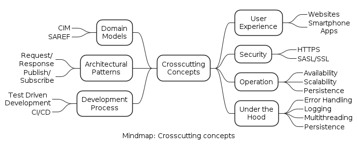

<!-- This section describes overall, principal regulations and solution ideas
that are relevant in multiple parts (= cross-cutting) of your system.
Such concepts are often related to multiple building blocks. They can
include many different topics, such as
-   models, especially domain models
-   architecture or design patterns
-   rules for using specific technology
-   principal, often technical decisions of an overarching (=
    cross-cutting) nature
-   implementation rules -->

There are various important concepts that are relevant to many parts of the system. The figure below shows an overview of these concepts in the form of a mindmap. The motivation for using some of these concepts is explained below.

 

## Domain Models
### CIM (Common Information Model)

**What it is:**
CIM is an electric power transmission and distribution standard developed by the electric power industry. It aims to allow application software to exchange information about an electrical network. It has been officially adopted by the International Electrotechnical Commission (IEC). CIM defines a common vocabulary and basic ontology.

**Where it is used:**
For this system, CIM is used as the target model for storing energy data in the [Database](../05-building-block-view/index.md#level-2) of the eligible party.

**Why it is used:**
Explanation here...

### SAREF (Smart Applications REFerence) 

**What it is:**
The SAREF ontology is a shared model of consensus that facilitates the matching of existing assets in the smart applications domain. SAREF provides building blocks that allow the separation and recombination of different parts of the ontology depending on specific needs. SAREF explicitly specifies recurring core concepts in the smart applications domain, the main relationships between these concepts, and axioms to constrain the usage of these concepts and relationships. It has been created based on the following fundamental principles: reuse, modularity, extensibility, and maintainability.

**Where it is used:**
For this system, SAREF is used to define data models for various processes.

**Why it is used:**
Explanation here...

## Security
### HTTPS

**What it is:** 
Explanation here...

**Where it is used:** 
Explanation here...

**Why it is used:**
Explanation here...

### SASL/SSL

**What it is:** 
Explanation here...

**Where it is used:** 
Explanation here...

**Why it is used:**
Explanation here...