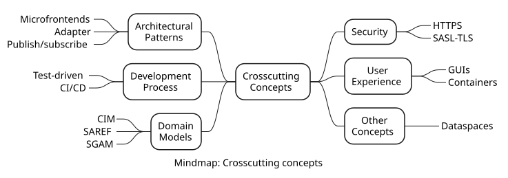

<!-- This section describes overall, principal regulations and solution ideas
that are relevant in multiple parts (= cross-cutting) of your system.
Such concepts are often related to multiple building blocks. They can
include many different topics, such as
-   models, especially domain models
-   architecture or design patterns
-   rules for using specific technology
-   principal, often technical decisions of an overarching (=
    cross-cutting) nature
-   implementation rules -->

## Overview

There are various important concepts that are relevant to many parts of the system. The figure below shows an overview of these concepts in the form of a mindmap. 

 

The following sections provide tables with links to more information about these concepts.

## Architectural Patterns

| Architectural Pattern | Section |
| - | - |
| Microfrontend | [Link](./crosscutting-concepts/microfrontends/microfrontends.md) | 
| Adapter | [Link](./crosscutting-concepts/adapter/adapter.md) | 
| Publish/subscribe | [Link](./crosscutting-concepts/publish-subscribe/publish-subscribe.md) | 

## Development Process

| Development Process | Section |
| - | - |
| Test-driven | [Link](./crosscutting-concepts/test-driven/test-driven.md) | 
| CI/CD | [Link](./crosscutting-concepts/ci-cd/ci-cd.md) | 

## Domain Models

| Domain Model | Section |
| - | - |
| CIM | [Link](./crosscutting-concepts/cim/cim.md) | 
| SAREF | [Link](./crosscutting-concepts/saref/saref.md) | 
| SGAM | [Link](./crosscutting-concepts/sgam/sgam.md) | 

## Security

| Security Mechanism | Section |
| - | - |
| HTTPS | [Link](./crosscutting-concepts/https/https.md) | 
| SASL - TLS | [Link](./crosscutting-concepts/sasl-tls/sasl-tls.md) | 

## User Experience

| User Experience | Section |
| - | - |
| Graphical User Interfaces | [Link](./crosscutting-concepts/gui/gui.md) | 
| Containers | [Link](./crosscutting-concepts/containers/containers.md) | 

## Other Concepts

| Concept | Section |
| - | - |
| Dataspaces| [Link](./crosscutting-concepts/dataspaces/dataspaces.md) | 

