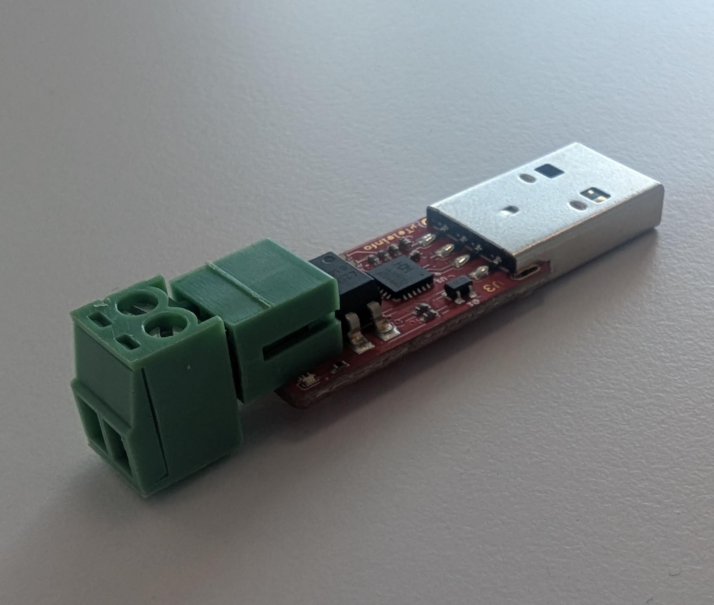

The [Micro Teleinfo V3.0](https://www.tindie.com/products/hallard/micro-teleinfo-v30/) is a Data Source that supports smart meters in **France**. This Data Source is shown below.

## Connection to Metering Devices

The Micro Teleinfo connects to smart meters via the Téléinfo interface over a dedicated plug connector. Once connected, the Micro Teleinfo reads data from the smart meter, including near real-time electricity consumption, total energy consumed, and other relevant data.

## Connection to AIIDA

The Micro Teleinfo connects to AIIDA via a USB port on the Raspberry Pi which receives serial data. This data is then sent to AIIDA via MQTT.

 

