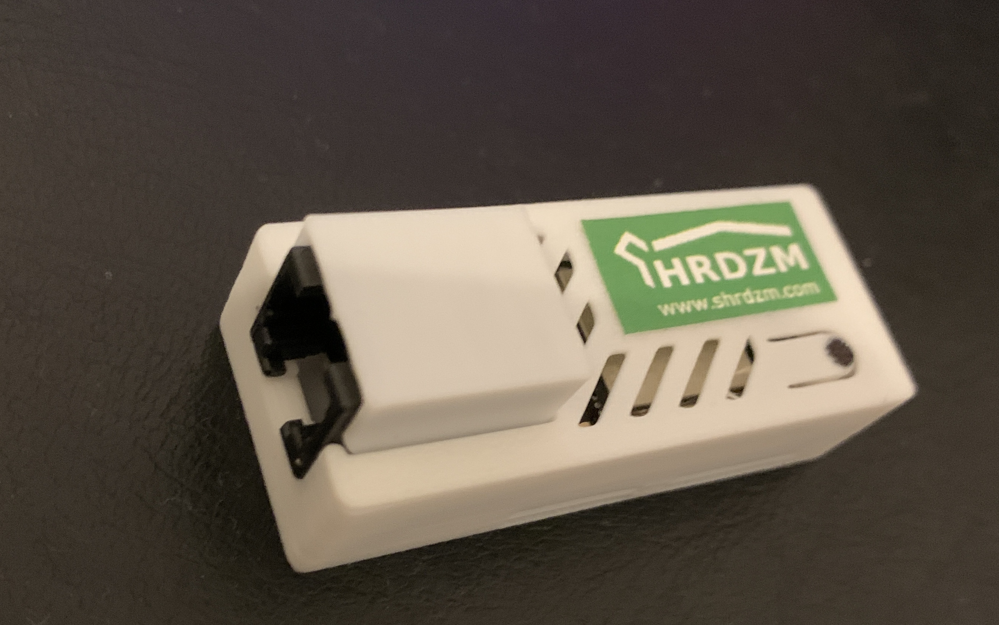

The [Smartmeter Kundenschnittstellen Modul](https://cms.shrdzm.com/produkt/smartmeter-modul/) developed by SHRDZM is an Data Source that supports smart meters in **Austria**, **Germany**, **Slovenia**, **Luxembourg** and **Switzerland**. This Data Source is shown below.

## Connection to Metering Devices

The Smart Meter Adapter connects to smart meters via IR/MBus/P1 interface either wired or an optical IR head depending on the specific smart meter. Once connected and configured, the Smart Meter Adapter reads data from the smart meter, including electricity consumption and production data.

## Connection to AIIDA

To configure the Smart Meter Adapter, the customer can access a configuration web interface via WiFi. Through this interface, the Smart Meter Adapter can be configured to send real-time energy data to AIIDA via MQTT.
