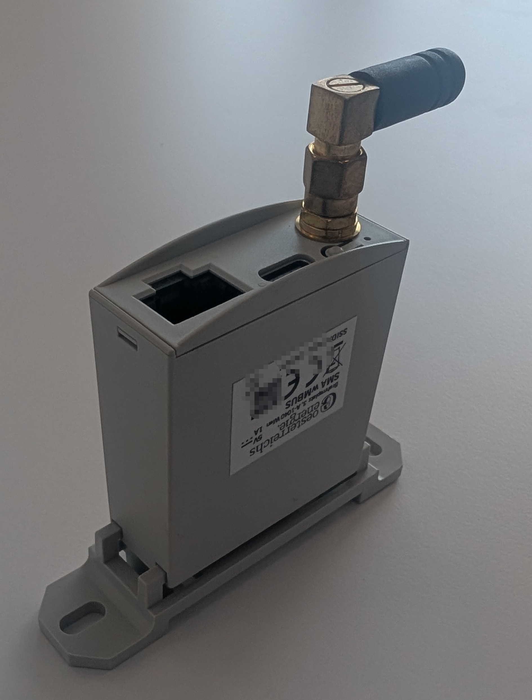

The [Smart Meter Adapter](https://oesterreichsenergie.at/smart-meter) developed by Oesterreichs Energie is an Adapter Device that supports smart meters in **Austria**. This Adapter Device is shown below.

## Connection to Metering Devices

The Smart Meter Adapter connects to smart meters via M-Bus (Meter-Bus). Once connected, the Smart Meter Adapter reads data from the smart meter, including electricity consumption and production data.

## Connection to AIIDA

To configure the Smart Meter Adapter, the customer can access a configuration web interface via WiFi. Through this interface, the Smart Meter Adapter can be configured to send real-time energy data to AIIDA via MQTT or Modbus TCP.