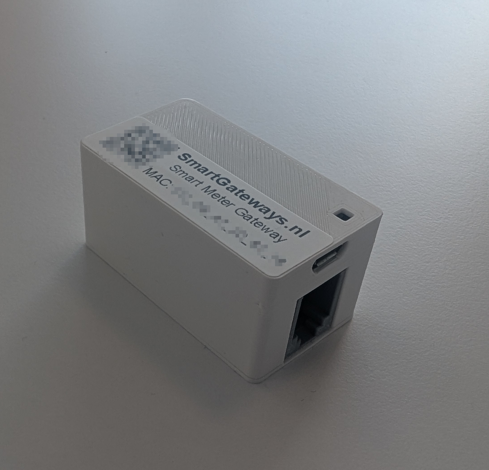

The [Smart Meter WiFi Gateway](https://smartgateways.nl/en/product/smart-meter-wifi-gateway/) is an Adapter Device that supports smart meters in many countries including **the Netherlands, Belgium, Sweden, Denmark, Finland, Hungary, Ireland, Lithuania, and Switzerland**. This Adapter Device is shown below.

## Connection to Metering Devices

The Smart Meter WiFi Gateway connects to smart meters via a P1 interface (over an RJ12 port). Once connected, the Smart Meter WiFi Gateway reads data from the smart meter, including electricity and gas consumption data.

## Connection to AIIDA

To configure the Smart Meter WiFi Gateway, the customer can access a configuration web interface via WiFi. Through this interface, the Smart Meter WiFi Gateway can be configured to send real-time energy data to AIIDA via MQTT or HTTP.