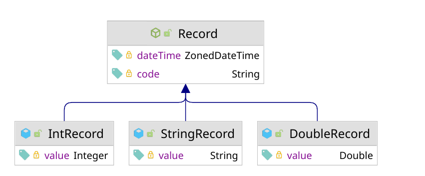

There are two relevant databases for AIIDA, the internal Timescale DB, that stores the actual on-site energy data, and the EMQX IAM Database on the EDDIE Framework site, that is used for identity access management (IAM) and user credentials. It is important to mention, that EDDIE in general follows the CIM model; However, AIIDA or the Timescale DB respectively, uses its own model.

## Timescale DB 
As mentioned, a household's data is stored at a Timescale DB. It is specifically designed for storing time-series data, i.e., chronologically organized datasets, including measurement series like those of AIIDA. Timescale DB is based on PostgreSQL, adding several features for a more efficient handling of time-series data, such as automatic partitioning, hypertables for managing large datasets, analytical functions, and more. 
The following picture shows how the measurement data is stored as a timescale record:

## EMQX IAM Database
This Database comes with the MQTT broker which is needed at the EDDIE Framework site.
While the MQTT broker mediates all messages between the EP and AIIDA, the IAM database ensures that only authorized clients have access to specific topics, enhancing the security of the network.
The IAM database enables the separation and management of permissions between different users and groups, as the MQTT broker is shared by multiple users.
Managing identities and access rights through a centralized IAM database also allows dynamic adjustments of rules and permissions without the need to reconfigure the broker itself. 

The IAM database in EMQX stores information about users, topics, groups, access rights, and permissions.
It allows the definition of security policies that specify who can access which MQTT topics and what actions (e.g., publish, subscribe) can be performed.
The IAM database also contains information about authentication methods, such as username/password or certificates.
