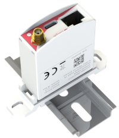

The smart meter adapter by Oesterreichs Energie supports all smart meters deployed in Austria, regardless of their physical interface.

## How to use with AIIDA
 - Get the appropriate smart meter adapter for your smart meter (see their website for details and where to purchase an adapter).
 - Connect the adapter to your smart meter and configure it to publish the data to a MQTT broker. You can use a cloud MQTT server, although a local one would probably provide better latency and privacy/security if configured correctly.
 - Add the OesterreichsEnergieAdapter data source at the AIIDA data sources UI, and enter the same MQTT broker, and if necessary authentication credentials.

The data is now available in AIIDA. 

The following picture shows an example for a smart meter adapter, taken from [Österreichs Energie](https://oesterreichsenergie.at/smart-meter/technische-leitfaeden).

