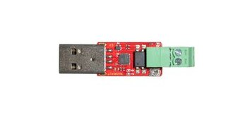

The MicroTeleinfoV3 USB adapter supports the connection with the Linky smart meter in France. It converts the data retrieved to a serial interface.
In order to connect with the USB dongle, it has to be both plugged into a system which supports USB and an internet connection such as a raspberry pi.
The USB dongle must then be connected to the Linky smart meter via 2 small cables, like a telephone wire. 

## How to use with AIIDA
In order to add the MicroTeleinfoV3 as datasource in AIIDA, the properties of the datasource have to be adapted correctly. The datasource has to be enabled, an ID has to be assigned to it and the broker uri, to where the datasource should connect, has to be added. Provide the username and password in order to authenticate to the MQTT broker you want to connect to if necessary or leave empty. 

The following picture shows an example for a smart meter adapter, taken from the official [tindie product site](https://www.tindie.com/products/hallard/micro-teleinfo-v30/).

