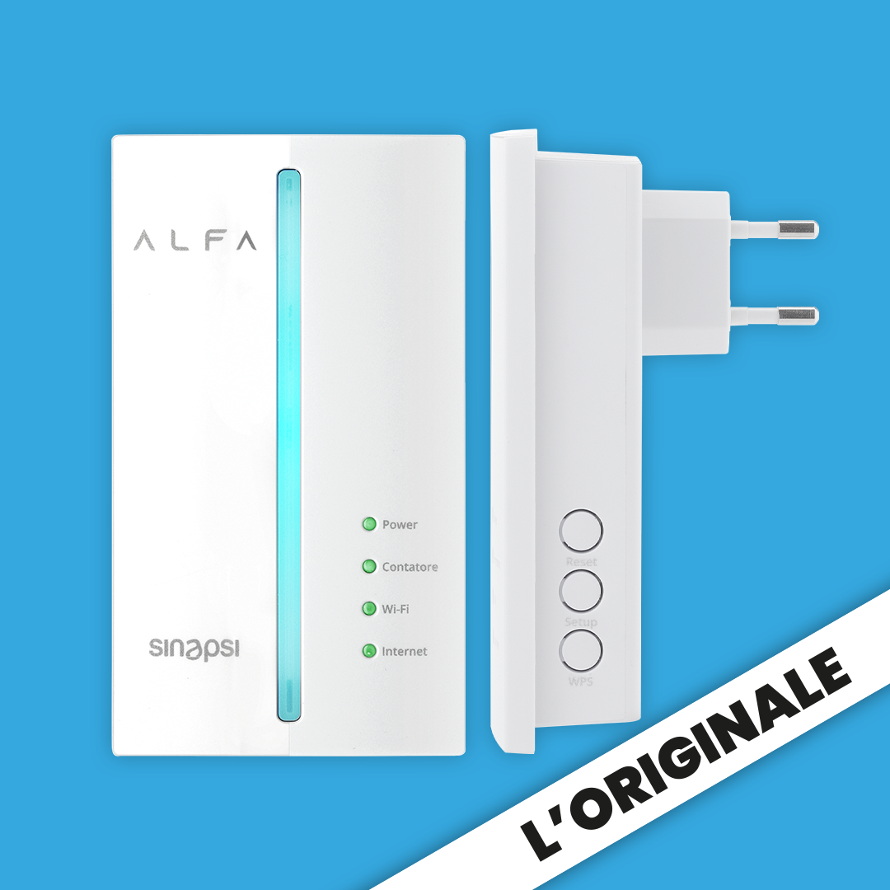

# Sinapsi Alfa
The Italian meter is using power line communication (PLC) as the near real-time customer interface.
As PLC has limited bandwidth, unlike other smart meters, the Italian smart meter is only pushing measurements approximately every 15 minutes and in the event of a spike in consumption.
There are thresholds in 300 Watt gaps (i.e. 300W, 600W, 900W, ...).
Each time such a threshold is crossed, the smart meter will push the new measurements.
E.g. when the power consumption changes from 150W to 480W, a new measurement will be pushed, but if the consumption changes from 310W to 580W, no new measurement will be sent.

The Italian company Sinapsi has created a device called Alfa which can be plugged into a socket anywhere in a customer's home, and it will record the PLC readings from the smart meter and push it into their cloud.
Sinapsi provides a smartphone app that displays these values.

The Alfa device also outputs the measurements via Modbus TCP, and Sinapsi offers a guide how to integrate Alfa into Home Assistant (a home automation system).
The guide includes a configuration.txt file that details the Modbus TCP addresses, values and datatypes.
The IP of the Alfa device can be seen in Sinapi's app.

The following picture shows the Sinapsi Alfa device, taken from the official [Sinapsi website](https://www.alfabysinapsi.it/prodotto/alfa-bianco/).

